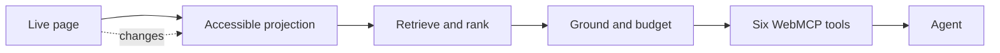

# About Naviquest

## Executive summary

**Naviquest is a client-side JavaScript SDK that turns a live web page into six compact research tools for AI agents.**

An agent that needs one sentence from a page is usually handed the whole page. A
raw DOM snapshot runs 10k–125k+ tokens, and 42% of them exceed a 128k context
window outright; even an accessibility tree stays above 15k. The agent re-reads
that dump on every step, and its DOM references go stale the moment the page
changes. **The cost is structural — it grows with the page.**

My answer was to move the work rather than shrink the dump. The page is already
fetched, parsed, styled, and semantically annotated inside Chromium, so I made
**the browser the research layer**: Naviquest projects the live DOM and ARIA
state, retrieves relevant evidence inline or in an optional worker, grounds it
on the page thread, and returns only a bounded answer plus a semantic address
the agent can resolve again. The page itself never enters the model's context.

| | Whole-page approach | Browser as the research layer |
|---|---|---|
| What the model receives | the page (10k–125k+ tokens) | a budgeted answer (**~1–2k** target) |
| Cost as the page grows | grows with it | **flat** |
| After the page changes | re-read the dump; DOM refs go stale | re-resolve a semantic address |
| Where the work happens | your context, your backend | the tab, on device |

No model is required for any of it. Retrieval is deterministic — accessibility
projection, BM25 with heading weighting, structural priors — and Chrome's
on-device AI is a progressive enhancement that fails open to that baseline.

Naviquest supports the places agents already work:

- **Websites:** embed the SDK for first-party and in-app agents.
- **Automation:** inject the same bundle into an unmodified page on any origin.
- **Web applications:** register six WebMCP tools or call the same developer-facing JavaScript API directly, with optional orientation and exclusion metadata.
- **Agent resources:** discover same-origin `llms.txt` and `llms-full.txt` manifests, retrieve their declared resources, and fall back to live page links when no manifest exists.

In my hackathon evaluation over 20 tasks, Naviquest scored **20/20** on blind-judged quality against the direct-fetch agent's **19.5/20**, while using:

- **2.6× fewer median tokens per task**
- **4.1× fewer total tokens** (52,822 vs 214,481)
- **24.6× less context in the largest response** (1,551 vs 38,198)

The direct-fetch agent was **2.3× faster** in wall-clock — one `fetch` is a single round-trip. Naviquest's demonstrated advantage is context efficiency, not speed.

## What inspired Naviquest

Web agents are often handed raw HTML, DOM snapshots, or accessibility trees containing tens of thousands of tokens. Somewhere inside that dump might be one sentence or one control the agent needs.

The model then has to:

1. Parse the page structure.
2. Separate content from navigation and hidden interface elements.
3. Find the relevant evidence.
4. Repeat the work after the page changes.

Context cost grows with page size, and references to DOM nodes become stale. I started the hackathon with one question:

> What if the browser did the research and returned only the evidence the agent needs?

## What I learned from creating Octocode

Naviquest did not begin from a blank page. I brought methodologies I learned while creating Octocode.ai, an agentic code-research tool designed to find, understand, and prove context without sending an entire repository to the model.

Octocode follows a disciplined loop: **orient → search → read exact evidence → prove → decide**. For Naviquest, I adapted that approach to a live browser: **orient → find → resolve → act → observe**. Both systems use progressive disclosure, bounded responses, revisitable source references, and explicit uncertainty. Octocode addresses code and GitHub research; Naviquest applies the same lessons to changing web pages through a separate browser-native implementation.

## I started with accessibility

My first insight was that accessible names, roles, headings, landmarks, relationships, and state express intent better than raw markup.

Page JavaScript cannot read Chrome's computed accessibility tree directly. Naviquest therefore derives accessible names with `dom-accessibility-api`, adds a focused implicit-role layer, and projects only the authored semantics needed for research and action.

That gave me a semantic view of the page, but not a complete research system. Real websites have inconsistent accessibility, hidden and virtualized content, shadow roots, frames, dynamic state, and controls whose properties change without producing DOM mutations.

I kept accessibility as the foundation and added the missing layers:

- Authored visibility and live control state
- Open shadow-root and slot traversal
- Same-origin frame content with frame-qualified addresses
- International text segmentation
- Explicit reporting for inaccessible content
- Retrieval, grounding, freshness, and response budgets

## How I built it: from page snapshot to live research engine

Naviquest grew into a client-side TypeScript SDK with one pipeline:



Inside the tab, Naviquest:

1. Projects meaningful content and controls.
2. Segments the page into searchable regions.
3. Retrieves evidence with BM25 and optional dense ranking.
4. Grounds answers in authored page text.
5. Returns bounded records instead of partial JSON.
6. Attaches semantic addresses that can be resolved against the live page.

Content and controls use separate indexes. Exact text evidence runs beside BM25 rather than overriding it; heading weight improves section matches, while declared structural signals demote navigation, citation blocks, and image-only descriptions. When dense retrieval is available, Reciprocal Rank Fusion combines it with BM25 instead of replacing the lexical result. The answer layer asserts a sentence only after its support gate clears.

The same implementation supports two modes. A website can embed Naviquest directly, or an automation host can inject it into an unmodified page.

## Six tools became one workflow

I did not want to replace one page dump with dozens of disconnected tools. Naviquest exposes six tools that form one research loop:

**Orient → Find → Resolve → Act → Observe**

| Tool | Role in the story |
|---|---|
| `describe_app` | Orient to the page, its structure, changes, and coverage gaps. |
| `find_on_page` | Find an answer and the region supporting it. |
| `locate_control` | Find the live control that matches an intended action. |
| `resolve_address` | Resolve evidence or a control against the current page. |
| `query_selector` | Inspect actions, forms, regions, or known CSS matches. |
| `agentic_content` | Discover same-origin resources and linked pages. |

For example, an agent can call `describe_app` to learn the page vocabulary, then use `find_on_page` to retrieve evidence. It can pass the returned address to `resolve_address`, let the host perform an action, and call `describe_app({ changesSince })` to observe the result. Tool responses include bounded recovery hints when the next step is ambiguous or evidence is incomplete.

Naviquest performs research and grounding. The browser host performs privileged actions such as clicking, typing, navigation, and screenshots.

## Then I made it survive real pages

A useful answer can become wrong when the page changes. Naviquest combines `MutationObserver` with signals for slots, toggles, frame loads, resizing, fonts, URLs, and composed-tree shape.

When something changes, a generation-aware rebuild prevents an older worker result from replacing newer state. Controls also re-read live properties such as `checked`, `disabled`, `selected`, and validity because property changes do not always create mutation records.

After an action, the agent can ask what changed instead of reading the page again.

## Chromium became the runtime

I built Naviquest around browser-native capabilities:

- **WebMCP** publishes the six tools through `document.modelContext`.
- **Web Workers** move pure indexing and ranking away from the page thread.
- **`Intl.Segmenter`** avoids English-only tokenization.
- **Geometry APIs** return current action boxes.
- **CSS Custom Highlight API** marks evidence without wrapping host content.
- **Cache Storage and Web Locks** coordinate optional model assets.
- **Chrome DevTools Protocol** injects Naviquest and performs privileged actions.

Chrome built-in AI remains an enhancement rather than a dependency:

| Capability | What Naviquest does with it | Status |
|---|---|---|
| **Prompt API** | Verifies answers, extracts quote-grounded region answers, and describes unreadable images or canvases. | Implemented; optional |
| **Summarizer API** | Compresses long grounded responses while preserving addresses to the source. | Implemented; opt-in |
| **Language Detector and Translator** | Translates a query into the page language and fuses both retrieval runs. | Implemented; off by default |
| **Static Model2Vec** | Adds optional int8 dense ranking through Reciprocal Rank Fusion. | Implemented; model assets absent from this checkout |
| **Semantic Embedder** | Replaces site-shipped vectors with a browser-managed embedding model. | Next phase; not implemented |

If any model is unavailable, cold, slow, or invalid, Naviquest keeps the deterministic lexical result.

## What I learned from Chrome and Chromium

I began with Chrome's [built-in AI documentation](https://developer.chrome.com/docs/ai/built-in), then traced the corresponding Blink IDL and browser implementations in 
the Chromium project. That source research showed me which behavior was a stable contract, which behavior needed a runtime probe, and which APIs were still experimental

It changed several implementation decisions:

- Use the platform's `availability() → create() → execute()` lifecycle instead of assuming a model exists.
- Require intentional activation for model downloads and monitor their progress from the browser host.
- Pass `AbortSignal` to every bounded model operation.
- Use Prompt API response constraints and quote-check generated answers against page evidence.
- Clone Prompt sessions per turn so unrelated calls do not share conversation history, then destroy each clone.
- Keep the zero-model BM25 path available before, during, and after AI initialization.
- Probe worker exposure and Permissions Policy behavior in the installed Chrome build instead of inferring them from Chromium main.

The research also told me what **not** to add. Writer and Rewriter produce text rather than page evidence, Proofreader can change query intent, and Prompt tool use duplicates the external agent's router. I kept those outside Naviquest's grounded research flow.

For the next phase, Chromium's `SemanticEmbedder` contract provides batch embeddings, retrieval-specific query and document task types, cancellation, and worker exposure. Chromium IDL does not expose a stable embedding-space identifier, so my plan keeps vectors in one live session and forbids persistence until the platform can prove compatibility.

## I tested the idea with real agents

I compared two agents on the same 20 research tasks across 10 sites. One used Naviquest. The other received readability-extracted page content and cached pages it had already fetched.

| Result | Naviquest | Direct fetch | |
|---|---:|---:|:--|
| **Blind-judged answers** | **20 / 20 correct** | 19.5 / 20 | **effectively tied** |
| **Total tokens** | **52,822** | 214,481 | **4.1× fewer** |
| Tokens per question (median) | — | — | **2.6× fewer** |
| **Largest single response** | **1,551** | 38,198 | **24.6× smaller** |
| Wall-clock | 15,176 ms | 6,479 ms | direct fetch **2.3× faster** |

The Chrome skill launches a real browser, injects the SDK before navigation, and invokes tools through the WebMCP CDP domain. The evaluation charges every payload with the same audited `chars/4` estimator and streams the run to the dashboard.

This is a POC-scale result: 20 findings, one run, and no confidence intervals. The half-point quality difference is noise, not a demonstrated edge. The useful result is that answer quality held while the agent received about one quarter of the content. Small pages can favor direct fetch—the baseline won both `nodejs.org` questions—while Naviquest's per-tool budgets keep large-page responses bounded. If a minimum valid record cannot fit, the SDK returns its smallest valid payload and declares `_overBudget` rather than truncating silently.

### What Chrome's on-device AI costs when I turn it on

I re-ran the same workload with Chrome's models enabled:

| naviquest arm (paired against itself) | AI off | AI on |
|---|---:|---:|
| Blind-judged quality | **20/20** | 19.5/20 |
| Total tokens | **46,891** | 56,284 (+20%) |
| Wall-clock | **17,787 ms** | 90,187 ms |

Model setup—about 25.4 seconds per document—dominated the AI path. The models added cost without a quality gain on this workload, so deterministic retrieval remains the default.

## Challenges I faced

**Chrome's computed accessibility tree is unavailable to page JavaScript.** The
page does not expose the semantic view I wanted to build on. I built an
authored-semantic projection from DOM, ARIA, visibility, relationships, and live
control properties instead, and made it report what it cannot reach rather than
pretend the gap is not there.

**Web pages do not stay still.** An answer that was right a second ago can be
wrong now. Generation-aware rebuilds stop a stale worker result from overwriting
newer state, and semantic addresses resolve against the current page rather than
holding a DOM pointer that rots.

**Efficiency had to preserve correctness.** A budget that truncates mid-record
produces invalid JSON, so the budget is record-aware. One shared ranker serves
both the page and worker paths so there is never a second implementation to drift.

**Every tool call failed on any page with an iframe — and I only found out
because I built the eval.** The SDK's install script runs on every new document,
so a page with embeds registers the six tool names once per frame, and my host
refused the ambiguity. react.dev and vuejs.org failed *completely* on the first
race. The fix was to address the page's main frame and treat sub-frame
registrations as noise; it cut tool calls on react.dev from 29 to 14 and the
run's total by 22%. I covered it with a regression whose sub-frames carry a
**decoy answer**, so reading the wrong frame now fails loudly instead of quietly
returning something plausible.

**A tool that could not answer returned nothing at all.** Not an error, not an
empty result with a hint — a bare `null` with a "Completed" status. From outside
there was no way to tell "no match on this page" from "the tool is broken." The
host now surfaces the raw response, any parse error, and the content shape
whenever the payload is null. The SDK-side half of that — `find_on_page` should
return an empty result with a hint rather than an empty response — is still open,
and I wrote it up rather than quietly leaving it.

**Chrome's on-device AI needs a warm-up that nothing tells you about.** Gemini
Nano's session is scoped per document and its first prompt costs about 19
seconds, which the SDK fires in the background and fails open on. So the first
retrieval call on a fresh page comes back with **no `answer` key at all** — not
`unverified`. That matters because the reader-priming logic only retries on
`unverified`, so an absent answer never triggers priming and the AI path stays
silently cold while still reporting itself as on. Any AI run has to warm each
document explicitly, and I made the measurement script fail if the AI path never
engaged, so a run cannot claim AI while measuring the deterministic path.

**My own reporting had a bug that flattered the wrong side.** I was rounding a
ratio to one decimal and then taking its reciprocal: 6,479/15,176 = 0.4269 rounds
to 0.4, and 1/0.4 reports the baseline as 2.5× faster when it is really 2.3×.
Rounding twice inflated a headline by 7%. The inverse is now computed once from
the raw milliseconds. It was a small error in the direction of overstating my
competitor, which is exactly the kind that survives review because nobody
challenges it.

## The next phase: browser-managed embeddings

Naviquest ranks lexically today. On my dense evaluation, fused ranking reaches
**71% hit@1**, compared with **67%** for BM25 alone and **57–62%** for the static
dense lane alone. Chrome's experimental Semantic Embedder could improve
paraphrase retrieval without making sites ship model assets, but it remains
flag-gated and unapproved for shipping.

I probed Chrome 152 instead of treating Chromium main as a browser contract.
The API was absent from stock Chrome, reported `downloadable` behind its
experimental flag, and was exposed inside a dedicated worker. That last result
means a future corpus-embedding pass can remain off the main thread.

**Where it plugs in.** As a *provider behind the existing dense seam*, not a new
lane:

```
createNaviquest({ worker: true, dense: true, denseProvider: 'browser' })
  → embed documents   embed({ taskType: 'retrieval-document' })
  → embed query       embed({ taskType: 'retrieval-query', signal })
  → fuse(lex, dense)  the existing RRF
```

The design keeps vectors in one live session because Chromium exposes no stable
embedding-space identifier. It also preserves BM25 as the zero-download floor.
The provider ships only if a held-out evaluation improves retrieval without
regressing literal queries, address round-trips, or response budgets. None of
it is implemented today.

## What I learned

- **Moving the work beat shrinking the payload.** The largest gain came from
  keeping irrelevant page data out of the agent's context, not from compressing
  it after transmission.
- **Deterministic retrieval must own the evidence.** On-device models added 20%
  more tokens and five times the wall-clock without improving quality on this
  workload. They remain optional enrichment.
- **A benchmark must be capable of losing.** The first questions were too easy
  and produced a meaningless tie. Enumerations and exact-field questions made
  the evaluation more discriminating.
- **Real-browser evaluation found real defects.** It exposed iframe registration
  ambiguity and silent null responses that fixtures did not reveal.
- **Probe experimental APIs in the installed runtime.** Chromium source revealed
  possibilities; Chrome probes established what the tested build exposed.
- **Publishing losses builds trust.** Direct fetch won on two small pages and on
  speed. Those results clarify where Naviquest helps instead of weakening the
  larger-page result.

Naviquest remains a proof of concept, but the result supports the idea I began
with: **the browser can preserve answer quality while carrying far less page
context into the agent.**
