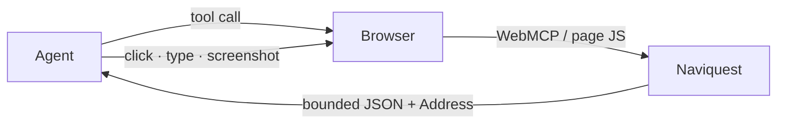
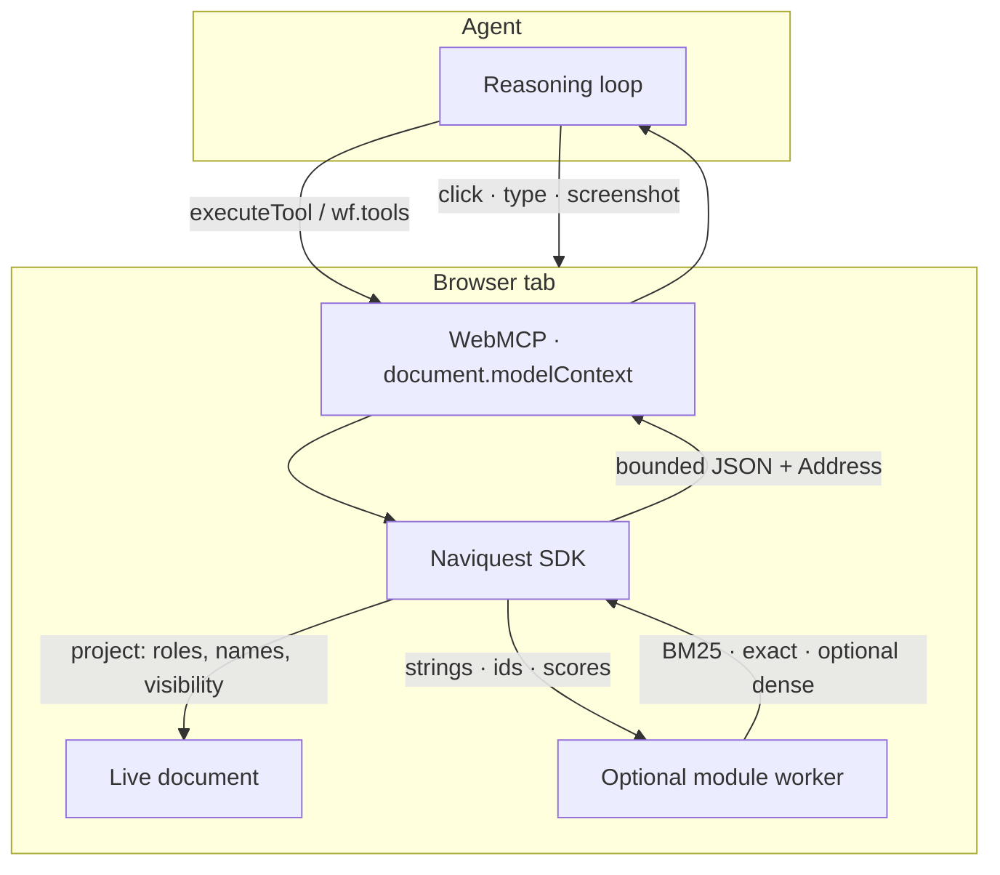

# Architecture

`@naviquest/core` is a browser-side WebMCP SDK. **Ask the page. Don't dump it.** Agents
call six token-budgeted tools; each answer is a region or live control, not the document.

**§§ 1–10 are the design. §§ 11–23 are the mechanism.** Tool reference:
[docs/TOOLS.md](./docs/TOOLS.md); browser APIs: [docs/TECHNOLOGY.md](./docs/TECHNOLOGY.md);
product surface: [README.md](./README.md); before changing anything: [AGENTS.md](./AGENTS.md).

## At a glance

The agent talks to the browser; the browser talks to Naviquest **in the tab**. Naviquest
never clicks.



Inside the tab:



**Features.** Accessibility projection · heading-aware segments · BM25 + exact (optional int8
dense + RRF) · re-resolvable addresses · token budgets / `since` / `changesSince` · optional
first-party `authored` overlay (not required; inject navigates any page from live structure) ·
worker retrieval · optional Chrome Summarizer · CSS Custom Highlight · `llms.txt` · schema.org
FAQ · declared coverage.

**Tools.** `describe_app` · `find_on_page` · `locate_control` · `resolve_address` ·
`query_selector` · `agentic_content`. Region read is `resolve_address`; opaque boxes are
`describe_app({ opaque: true })`.

**Build path.** Document → project (ARIA, names, visibility) → segment (`Intl.Segmenter`) →
index (BM25, exact, optional dense in a module worker) → rank → six tools → bounded JSON.
Projection stays on the main thread.

**In the page (from `packages/naviquest/src`).** Detail and rejected substitutes:
[docs/TECHNOLOGY.md](./docs/TECHNOLOGY.md).

| Area | What runs |
|---|---|
| WebMCP | `document.modelContext` (`navigator.modelContext` fallback); `AbortController` on register |
| Accessibility | Hand `roles.ts`; ARIA reflection; bundled `dom-accessibility-api`; `checkVisibility` |
| Document | Light DOM, open shadow, slots, `registerRegion` for closed roots, readable frames |
| Text | `Intl.Segmenter`, `Intl.Locale`, `Intl.DisplayNames`, Unicode fold |
| Retrieval | Okapi BM25, exact substring, optional int8 Model2Vec + RRF (`k = 60`) |
| Worker | ESM `Worker`; strings / ids / scores only; Cache API; Web Locks; `saveData` veto |
| Freshness | `MutationObserver`, `slotchange`, `toggle`, frame `load`, URL / tree, resize, fonts |
| Scheduling | `scheduler.yield()` (+ timer) for sliced `projectAsync` |
| Geometry | `getBoundingClientRect`, `visualViewport` |
| Modality | `:modal`, `inert` |
| Highlight | `Highlight`, `StaticRange`, `CSS.highlights` |
| Summary | Chrome `Summarizer` on the page `Window` after grounding (`summarize: true`) |
| Site | same-origin `llms.txt`; schema.org JSON-LD FAQ |

Not used on purpose: WASM, `SharedArrayBuffer`, Navigation API as freshness source of truth,
axe-core at runtime, inferred action tools from ARIA.

> **Verification is layered, not comprehensive.** The former 313-check harness is gone;
> deterministic browser contracts now cover tool behavior, roles, selectors, surface
> invariants, and the eager bundle budget. Live-site scripts and the ten-site audit exercise
> retrieval against third-party pages but are not stable regression gates. Historical figures
> remain dated design evidence; § 10 separates them from current, rerunnable sensors.

---

## 1. The problem: an agent arrives on a page it has never seen

Before acting, an agent must answer four questions:

1. **Where am I?** What page, what sections, is a dialog blocking me?
2. **What does it say** — about *the thing I was asked*, not everything.
3. **Which control does what I want?** Which element performs this intent, not what selector
   matches.
4. **Is that control still there?** The page moved between reading and acting, because a human
   is using it too.

Today's tooling answers by **serialisation** — dump the DOM or accessibility snapshot into
context — at three costs a bigger window does not remove:

- **Enormous.** Across held-out live sites an orient → search → locate loop costs a **median
  13.7%** of the equivalent `aria` snapshot (removed `VALIDATION.md` § 6; cost tables:
  [docs/EVAL.md](./docs/EVAL.md)); on an earlier CityDesk snapshot a single `find_on_page`
  answer was 466 tokens against a 4,050-token DOM dump. Re-measure before quoting those.
- **Undifferentiated.** Chrome, cookie banner and footer arrive at the same weight as the
  answering paragraph; relevance is left to the model.
- **References die.** Playwright's `ref=e5` is a JS expando React reconciliation silently kills;
  `chrome-devtools-mcp`'s `uid` is positional and renumbers every snapshot — both fail *silently*,
  resolving to the wrong element rather than an error, the worst failure mode for an acting agent.

---

## 2. What WebMCP is, and what it is not

**WebMCP** lets a page declare tools an agent calls in-page, mediated by the browser. The surface
is four members (the event attribute is `ontoolchange`, firing `toolchange` — an earlier draft
called it `onchange`, not the spec name and not what `webmcp.d.ts` declares):

```js
document.modelContext.registerTool(tool, { signal })  // declare a tool
document.modelContext.getTools()                      // discover tools
document.modelContext.executeTool(tool, argsJson)     // invoke one
document.modelContext.ontoolchange                    // the tool set moved
```

Three consequences are why this package exists:

- **It standardises what a page can DO, not how an agent finds its way around** — a page declares
  `submitOrder()`, but nothing helps an agent work out *which* order or what the page says about it.
- **No state channel** — tools only, no resources/subscriptions/streaming. Issue #151 (*Reactive
  State Streaming via Resource Subscriptions*) and #93 (*Tool active state*) sit at **zero
  comments** since March 2026, so tracking live state means calling `get_*` tools every step.
- **No schema negotiation** — `inputSchema` is explicitly "a semantic hint" (issue #92), nobody
  owns validation, and an agent learns a page only from the strings its tools return.

Hence the rule **our vocabulary is the interface**: any closed list here becomes a closed list
inside every consuming agent, so vocabularies are open, declared, and carry provenance
([AGENTS.md](./AGENTS.md) convention 4).

> Naviquest is a **userland retrieval library** using accessibility structure as its data model.
> It asks the spec to adopt nothing, and WebMCP's own README disclaims being ingested by the
> accessibility tree — the relationship is one-way: we register ordinary tools.

---

## 3. The one idea

> Project the page into an addressable model once. Answer questions against that model. Return
> **descriptions that can be re-resolved**, never pointers. **Ask instead of assume.**

Six tools are registered on `document.modelContext` (and on the SDK object):

| Tool | Answers |
|---|---|
| `describe_app` | Where am I? Outline, landmarks, modality, coverage, vocabulary — or, with `opaque: true`, the unreadable-region boxes |
| `find_on_page` | What does this page say about X? Ranked passages, each with an address |
| `locate_control` | Which control does X? Ranked candidates with live state and confidence |
| `resolve_address` | Act on any address — control path: state + box; region path: section text + controls, routed by the address itself |
| `query_selector` | What can I do or see, and where can CSS inspect? Bounded semantic action/structure/scope views; or guarded exact CSS when known |
| `agentic_content` | What does this SITE publish for agents? `llms.txt`, listed, searched or read |

The first five answer about **this document**; `agentic_content` answers about **this origin** and
is the only one touching the network. All six declare **`untrustedContentHint: true`** because page
content is attacker-controlled; five declare `readOnlyHint: true`, but `resolve_address` is
conservatively `false` because its native-link result is the navigation seam.

---

## 4. The pipeline

```mermaid
flowchart TD
    DOM[Live DOM<br/>light + open shadow + slots] --> P[project.ts<br/>one work-stack pass]
    P --> N[ProjectedNode&#91;&#93;<br/>role · name · text · live-state facts · sparse relations]
    N --> S[segment.ts<br/>landmark → heading → containment → window]
    S --> C[Chunk&#91;&#93;<br/>text + heading path + elements]
    C --> L[lane.ts<br/>inline or worker]
    N --> L
    L --> BM[bm25.ts<br/>lexical, 0 bytes]
    L --> E[exact.ts<br/>literal evidence + offsets]
    L --> D[dense.ts<br/>int8 static embeddings]
    BM --> R[ranking.ts<br/>RRF fusion + confidence]
    D --> R
    E --> T
    R --> T[tools.ts<br/>6 answers + exact region coalescing + token budgets]
    T --> I[index.ts<br/>lifecycle + registration]
    I -.summarize: true.-> SU[summarizer.ts<br/>lossy Window-only response stage]
    SU --> I
    I --> MC[document.modelContext]
    T --> A[address.ts<br/>mint + resolve]
    A -.re-resolve at action time.-> DOM
```



**Only serializable retrieval facts cross the worker boundary** — heading-weighted and raw chunk
strings out, ranked `(id, score)` pairs plus literal `(id, start, end)` evidence back; no elements,
vectors, addresses, or DOM objects. The exact matcher and ranking code are shared by both lanes, so
scheduling cannot change the answer.

**Resolution is lazy** — no live index of nodes is kept; an address resolves against a fresh
projection at action time, which makes it survive a re-render.

**Summarization is downstream and optional** — the first tool call lazily loads the `tools.ts`
graph, which owns `summarizer.ts`; with `summarize: true` the summary service runs after the
ordinary bounded payload on the page `Window`, retrieval staying inline or in `worker.ts`. Generated
text can replace long response text but never addresses, provenance, state, counts, failure
guidance, or the exact call that recovers the deterministic source.

**The ARIA graph is sparse and paged, never dumped.** `query_selector`'s `actions` and `structure`
views answer "what can I do?" and "what can I see?" from the same projection; authored one-hop
`aria-controls`/invoker edges carry a safe target region address when one exists. Heading ancestry,
landmarks, row context, modality and collapsed disclosures stay embedded in the relevant row —
serializing every node and edge would recreate the context cost this pipeline removes.

**The DOM query graph is composed, but it is not the semantic index.** CSS is scoped to one
`DocumentOrShadowRoot`, so `dom.ts` enumerates those roots once: main document, open and registered
closed roots, then every recursively readable frame document (including frames inside shadow roots).
`view: "scopes"` pages that graph and exact CSS searches it by default; exact-CSS frame matches
retain a scope path and honestly have `address: null`.

Making frame **content** part of the *semantic index* is the opt-in **`discovery.frames`** (off by
default). With it on, `find_on_page` reaches same-origin frame passages, each carrying a
**frame-qualified Address** (`frame: "document/frame[N]"`) that `resolve_address` re-enters and whose
region read stays inside the frame; the segmentation key includes the frame, so a frame passage
never merges with or resolves to a same-heading top-document one. Off by default because same-origin
frames usually hold trivial content on the open web (what matters is cross-origin, unreachable by
page JS); worth turning on for an app shell that frames its own editor/gallery/docs, which the
`unindexedFrameDocuments` coverage gap signals. It indexes frame **reading** only — frame controls
stay out of the control index because their boxes are frame-relative (a fully-addressable control
would need coordinate translation), and a separately installed child SDK owns full click semantics.
Cross-origin and opaque-sandbox documents remain unreadable by same-origin policy and are declared,
never guessed.

**Pixels are browser-owned.** Page JS has no faithful general screenshot API; opaque mode returns
current viewport boxes and reasons, and the browser agent captures those boxes for OCR/vision.
DOM-to-canvas reconstruction is not a substitute for composited pixels or cross-origin content.

---

## 5. Module map

Structural, not a line-count leaderboard; it names every current ownership boundary.

| Boundary | Modules | Responsibility |
|---|---|---|
| Public lifecycle | `index.ts`, `tool-specs.ts`, `webmcp.d.ts`, `global.d.ts` | construct the SDK, load answer code, register six contracts, expose the page-side API, tear down |
| Browser projection | `project.ts`, `roles.ts`, `aria-taxonomy.ts`, `dom.ts`, `modality.ts`, `coverage.ts`, `nontext.ts`, `structured.ts` | turn reachable DOM semantics into bounded nodes, state, modality, non-text gaps, structured evidence |
| Regions and retrieval | `segment.ts`, `text.ts`, `exact.ts`, `bm25.ts`, `dense.ts`, `ranking.ts`, `answer.ts`, `affordance.ts`, `language.ts` | segment content, tokenize internationally, rank content and controls, extract grounded answers |
| Execution lanes | `lane.ts`, `worker.ts` | run the same pure retrieval contract inline or in a module worker |
| Identity and change | `address.ts`, `delta.ts`, `semantic-delta.ts`, `highlight.ts` | mint fresh-resolvable addresses, compare byte and semantic observations, highlight without DOM mutation |
| Tool answers | `tools.ts`, `agentic.ts`, `structure.ts`, `budget.ts` | six bounded responses, site-resource discovery, orientation, truncation, continuations |
| Policy and types | `config.ts`, `types.ts` | every host-overridable judgment and the shared vocabulary |

**`index.ts` owns the lifecycle; `tools.ts` owns the answers.** Split from one 1,362-line module by
dependency, not line count: nothing in `tools.ts` touches the document, worker, or
`document.modelContext` — every tool reads an existing projection and writes a payload. A rebuild's
replacement arrives in one mutable `IndexState` that `reindex()` assigns into, so a tool always sees
the current index without a getter per field. The pure-versus-DOM boundary is load-bearing: only
pure retrieval modules run in the worker or under Node; projection and address resolution stay in the
page because they need live browser state.

---

## 6. Addressing — the part that is actually novel

An address is a **description**, not a reference:

```js
{ landmark, landmarkName, headingPath, row, role, name, ordinal, peerCount }
```

It survives node replacement because it never depended on node identity:

- **`row`** — identical siblings (three "Toggle Todo" checkboxes) are told apart by row text alone;
  an ordinal into a list that reorders is not identity.
- **`peerCount`** — identical siblings at mint; without it, deleting an earlier sibling silently
  shifts later ordinals onto a different element, so a changed peer set downgrades to `AMBIGUOUS`
  instead of acting wrong.
- **Bounded relaxation** — when nothing matches exactly, resolution relaxes the heading path but
  **never crosses a landmark boundary** and requires a shared path prefix, so a "Submit" in a deleted
  section never resolves onto another section's "Submit".

Resolution returns `RESOLVED`, `AMBIGUOUS` (with candidates) or `NOT_FOUND` (with nearest matches) —
**never a wrong element, never a dangling reference.** `selectorOfLastResort()` exists only because
the agent's click tool lives outside the page and cannot hold a DOM reference; generated fresh, never
stored, never used for matching, always labelled — and `null` for a shadow-tree target, which has no
document-scoped CSS selector, rather than a plausible-looking one that cannot resolve.

---

## 7. Three lanes

| Lane | What changes | Cost |
|---|---|---|
| **inline** (default) | Promise-returning tools; BM25 on main thread | answer engine loads on first call |
| `worker: true` | Same tool surface; indexing leaves the main thread | optional worker chunk |
| `dense: true` | `potion-base-8M` int8 embeddings fused with BM25 by RRF | 3.9 MB of weights |

Three measured facts shape the dense lane: `potion-base-8M` **beats** the retrieval-tuned 32M model
at a quarter of the bytes; int8 quantisation is free (cosine vs f32 is mean 0.999969); and dense must
**never** replace lexical — alone it ranks *below* BM25 at rank 1, having no compositionality — so it
earns its place only in fusion.

The weights are never blocking: a query returns lexically while the table is still arriving, and every
response declares `retrieval: "lexical" | "hybrid"` so an agent can tell "no match" from "the model
has not landed yet". Warming is gated on `document.modelContext` existing (the one signal an agent is
plausibly present) and vetoed by `navigator.connection.saveData`; weights cache in the Cache API,
turning a measured 6.2 s first-query cost into a once-ever one.

---

## 8. Honesty contracts

The through-line: **an agent that is confidently wrong is worse than one that knows it is blind.**
Every degradation is declared in the payload.

- `retrieval: "lexical" | "hybrid"` — which ranker actually answered.
- `coverage` — components with no reachable shadow root, and components whose semantics live in
  `ElementInternals` and cannot be read from page JS at all. Measured at 217 across live sites; 80%
  of YouTube's.
- `describe_app({ opaque: true })` — meaning the text index could not read, each with a box to
  screenshot and the reason it was unreadable.
- Bounded responses return a revision-bound cursor for every omitted suffix; a silently trimmed
  response reads to a model as "that's everything".
- `affordanceSource` — the signal each affordance came from, keyed by affordance
  (`{ "submit": "type=submit" }`): markup-declared (`rel=next`, `hreflang`, `aria-controls`,
  `command`, `type=submit`) versus guessed (`name-pattern`, `sole-field`).
- `describe_app().vocabulary` — the affordance terms in play, grouped `authored` / `inferred`, so an
  unknown value is information rather than a parse failure.
- `_etag` / `since` — an agent re-observing every step pays ~8 tokens instead of ~900 when nothing
  changed. Measured **78.8%** saving across five steps.

---

## 9. Where the risk is

Named honestly, because these are most likely to be wrong.

- **The role and name layer is hand-written.** `roles.ts` maps elements to implicit roles itself —
  the riskiest component. The live sensor is `yarn eval --only roles` (`eval/eval.ts`) against
  `aria-query`, not the deleted `oracle-axe.ts` / `oracle-axtree.ts` harnesses. Accessible names have
  no independent oracle; the accname sensor (deleted in the eval merge) compares the bundled shim to
  whatever page JS can read. Chrome still has no page-JS `computedRole` / `computedName` (Chrome 152).
  Spec and browser genuinely differ on `<input type=password>` and unnamed `<form>`; those stay
  documented exceptions in the roles gate.
- **`project.ts` is the second-largest module** — one work-stack walk carrying visibility, naming,
  headings, rows, affordances, non-text and coverage. It resists splitting because a single pass is
  what makes projection linear (a removed VALIDATION note recorded the O(n²) regression from hoisting
  one check out of it), but it is where the next reader will struggle.
- **`INTERACTIVE` is derived, then narrowed** — the taxonomy answers "is this a widget", not "can an
  agent click it" (`gridcell` and `row` inherit `widget`); the narrowing list is a retrieval decision,
  written down as one.
- **Segmentation degrades on structureless pages** — the floor is fixed ~200-word windows, which
  published evaluation finds matches or beats embedding-similarity chunking, so a structureless page
  loses the in-document gain, not correctness.

---

## 10. Verification layers

No one sensor proves the complete browser behavior. Use these together:

| Sensor | Scope | Named run |
|---|---|---|
| `yarn eval` | deterministic six-tool contracts, semantic changes, privacy, navigation provenance, live-link routing, cursors, input guards, authored locate / exclude | **48/48** (2 Sep 2026) |
| `yarn eval --only roles` | `roles.ts` against `aria-query` in Chrome | 0 undocumented drift |
| the selector sensor (deleted in the eval merge) | deterministic composed scopes plus live React and New York Times probes | 118/118 (2 Sep 2026) |
| `yarn eval --only surface` | model-visible description budget | **1,507 / 2,200** estimated tokens (2 Sep 2026) |
| `yarn build` | complete eager static closure plus disclosed lazy and worker chunks | Eager gzip under the **27.9 kB** gate (re-run; do not quote an old kB figure) |
| the summarizer sensor (deleted in the eval merge) | main-window orchestration, smart skip, time/token accounting, privacy, recovery, fallback, payload efficiency | 12/12; long-region fixture 1,344 → 379 estimated tokens (2 Sep 2026) |
| the ten-site navigation sensor (deleted in the eval merge) | ten public sites, three questions each, expected labels hidden from Naviquest selection | 1 Sep 2026: Naviquest 60/60, 28/30 rank-1, 26,424 payload tokens; Playwright ceiling 57/60, 68,733 tokens |
| targeted live contract audit | MDN, React, Wikipedia, GOV.UK, NHS | navigation, URL provenance, semantic state/focus, privacy, budgets verified; ranking limitations in [docs/EVAL.md](./docs/EVAL.md) |

**Where the code lives.** `src/` is grouped by subsystem, the grouping being the eager/lazy boundary
made visible: `page/` is the projection and is eager; `retrieval/`, `ai/` and `tools/` load on the
first tool call. Only the two entry points and three near-universal imports sit at the root —
`index.ts`, `worker.ts`, `config.ts`, `types.ts`, `async.ts`. The dependency graph is a 9-level DAG
with zero cycles, kept so by measurement, not directory.

**What is eager, and what is not.** The eager closure is the projection: accessibility walk,
segmentation, addressing, structure, config, and the lifecycle in `index.ts`. Everything an agent
needs but a page does not — the six tool bodies (`tools.ts`), their schemas (`tool-specs.ts`), the AI
adapters, and since 2026-09-03 the **retrieval lane** (`lane.ts` with `bm25`, `lexical-index`,
`ranking`, `exact`) — loads on the first tool call. That boundary sits *after* the synchronous half of
a rebuild: `reindex()` projects, segments and builds the document strings synchronously at
construction (the DOM is a moving target, so the snapshot is taken now), and only `lane.build()` is
deferred. So `resolve()` and `highlightAddress()` answer immediately on a fresh instance, and inline
construction returns the API object rather than a promise — a contract, since hosts reach for `.tools`
on the next line. `loadTools()` awaits the first build, making "a tool exists" and "the index is
built" one event; `lane()` reports `ready: false` during the load window instead of guessing a
`stemLanguage` it cannot know yet.

The deleted 313-check and historical oracle harnesses still explain many design comments, but current
claims must name a sensor above. Public live pages are mutable and contaminated, so they diagnose
failure classes rather than gate ranking releases; projection, segmentation, or ranking changes still
need a deterministic fixture plus a fresh held-out live sensor.

See [TECHNOLOGY.md](./docs/TECHNOLOGY.md) for Web APIs and execution boundaries.

---

# How it works, stage by stage

§§ 1–10 are the design; what follows is the **mechanism**. Every claim is anchored to a file, and the
anchors are to *behaviour*, not line numbers (§ 5's table is generated for that reason).

## 11. Projection — `project.ts`

### 11.1 Why a work stack and not a `TreeWalker`

The main walk is an **explicit LIFO stack of frames**. A `TreeWalker` **stops dead at every shadow
boundary**, and open shadow roots plus slot reassignment are exactly what this SDK must cross;
recursion cannot be time-sliced (`await` in a recursive function awaits at *every frame*, costing more
than the long task it removes), so the recursion became a stack and only then could `projectAsync`
exist.

`createTreeWalker` survives in one place: `SHOW_TEXT` over a single element to join its text nodes for
**row identity**, because `textContent` welds `<span>Parking permit</span><span>Closed</span>` into
`"permitClosed"` — one junk token in the index and an unreadable row label in the response.

### 11.2 What one frame does, in order

A frame is `{ el, landmark, landmarkName }`; landmark context is carried *on the frame* and inherited
by children (how a recursive parameter survives conversion to a stack). `step(frame)`:

1. **`null` frame** → pop the row stack. A sentinel `ROW_EXIT` frame is pushed *before* an element's
   children, so it pops only after the whole subtree is done — a stack's answer to "leaving this
   element" with no call stack to hook.
2. **`SKIP_TAGS`** (`SCRIPT`, `STYLE`, `NOSCRIPT`, `TEMPLATE`, `HEAD`, `META`, `LINK`) → return. A
   performance shortcut, not a semantic rule: the UA stylesheet already `display:none`s all of them so
   `checkVisibility()` would reject them, but a set lookup is cheaper. `TEMPLATE` needs naming — its
   content lives in a separate `DocumentFragment` that is not `display:none`, just not in the document.
   - **One exception:** a JSON-LD block is a `<script>`, so the tag skip always hid it; it is read
     *here*, in document order, so its Q&A pairs land under the heading path of the containing section.
3. **`<slot>`** → push `assignedNodes({ flatten: true })`, filtered to elements, **in reverse** (a
   stack pops LIFO and assigned order *is* rendered order). Handled at the slot because
   `<style>…</style><slot></slot>` as direct children of a shadow root is the commonest web-component
   shape; walking the slot as an ordinary element visited its *fallback* content while the host's real
   light children were skipped via `assignedSlot`, **dropping 100% of the component's content,
   silently**. A slot with no assigned nodes falls through and indexes its fallback, which is correct.
4. **`isExcluded(el)`** → return without pushing children — subtree rejection, so an excluded or
   `aria-hidden` subtree never enters memory. Equivalent to `NodeFilter.FILTER_REJECT`.
5. **Custom element accounting.** `el.shadowRoot` is `null` for a *closed* root **and** for no root at
   all, indistinguishable to page JS; counting both as "closed" made the coverage note claim components
   were hiding content when many simply render in light DOM, so only `openRoots` is certain and the
   rest is reported as unknown.
6. **Role, name, state, affordances, non-text**, then push children.

### 11.3 Child order is load-bearing

Children are pushed **light DOM first, then `shadowRoot.children`**, both in reverse. An earlier
version descended into the shadow root *before* the host's own children, putting shadow content ahead
of light content in document order and therefore under the wrong heading path.

### 11.4 The dual visibility check

Two *different questions*; collapsing them into one was a measured defect:

| Question | Call | Why |
|---|---|---|
| Is this **text** semantically available? | `checkVisibility({ opacityProperty: true, visibilityProperty: true })` | Text at opacity 0 is text the user cannot read; `content-visibility:auto` is only a rendering optimization and its skipped descendants stay available to find-in-page, focus, accessibility |
| Can this **control** be clicked? | `checkVisibility({ visibilityProperty: true })` — **no `opacityProperty`** — then a non-zero `getBoundingClientRect()` | The `opacity:0`-input-under-a-styled-label pattern builds most custom checkboxes, radios, switches and file inputs; a skipped `content-visibility:auto` subtree must stay discoverable before scrolling |

One check for both dropped every `input.toggle` on TodoMVC — the app's only real action — while
Playwright listed all of them. Both calls fall back to `offsetParent` if `checkVisibility` throws.

> The modern option names. Legacy aliases `checkOpacity` and `checkVisibilityCSS` are *silently
> ignored* if misspelled, which is why the option names are asserted, not assumed.

The omitted `contentVisibilityAuto` option is deliberate: its default `false` still rejects authored
`content-visibility:hidden` but does not mistake Chromium's temporary off-screen display lock for
hidden page semantics. The deleted selector sensor pins both deferred prose retrieval and
deferred-control discovery.

### 11.5 Heading paths from containment, never from level numbers

**41.8%** of pages skip heading levels (worsening; 94.9% of pages using `<h6>` also skip), so the path
is *nearest preceding heading within each ancestor scope*, not "last `h1` / last `h2` / last `h3`".

`scopeOf(el)` finds the container holding a heading and its sibling content. The nearest *sectioning*
ancestor was too broad — a heading inside a plain `<div>` claimed all of `<main>` — so it climbs
through **wrapper** elements up to `project.maxWrapperClimb` (default 3), recovering
`<div class="mw-heading"><h2>`, the Wikipedia shape that produced empty heading paths on 100% of
sampled chunks.

A `<div>` is an **inferred heading** when computed style says so: `headingMinFontPx` (19), or
`headingMinWeight` (600) at `headingMinWeightFontPx` (16), and no longer than `headingMaxChars` (90).
30.6% of pages style headings this way rather than marking them up, and only computed style reveals it.
Phrasing children (`<span>`, `<code>`) stay inside the title via the same reading-order join as
passages; a block child means the element is a section, not a heading.

### 11.6 Rows, ordinals and peer counts

- **`row`** — the row element's own joined text, capped at `maxRowChars` (80). A row is identity only
  while it stays row-sized: Hacker News wraps its whole header in one `<td>`, and a truncated prefix
  gave every header control the row `"Hacker Newsnew | pas"` — so too long ⇒ **no row**, not a bad one.
- **`ordinal` / `peerCount`** are assigned in a **post-walk pass** grouping nodes by their identity
  tuple, because both are properties of a *set* not known until the walk ends; stored on the node, so
  spread copies keep them and `addressOf` costs nothing per call.

### 11.7 The post-walk O(n) passes

Three, each able to breach the long-task guardrail on its own at scale, so each gets its own slice
check in `projectAsync`: the JSON-LD sweep (blocks in `<head>`, outside the root), `extraRoots` (roots
from `registerRegion()`), and the ordinal/peerCount grouping.

### 11.8 `projectAsync`, and the tear guard

`projectAsync` is the **same pass under a slicing driver**, sharing `step()` with synchronous
`project()`. It checks elapsed time per work unit against `project.sliceMs` (default 8 ms — inside a
16.7 ms frame, so a slice cannot itself be the long task) and yields via `scheduler.yield()`, falling
back to `setTimeout(0)`. The clock is read **per work unit** because a frame's own cost
(`getComputedStyle`, `checkVisibility`, `computeAccessibleName`) dwarfs a clock read, and a slice can
never be tighter than the slowest single element.

**It is worker-lane only** — slicing inline projection adds scheduling latency without moving the
downstream index build off the main thread.

**The caller owns the tear.** Handing the main thread back means the DOM may change between slices, and
a torn projection mints addresses that do not resolve, so `reindex()` captures a mutation counter
before the walk; if it advanced, the projection is discarded and retried up to twice, then falls back
to one uninterrupted `project()`. Latency alone does not pass this change — address re-resolution must
stay at 100% on `eval:real`, because a faster projection that mints a dead address is a regression
whatever the millisecond column says.

## 12. Segmentation — `segment.ts`

Four levels, applied in order, degrading gracefully:

| # | Level | Trigger | Coverage |
|---|---|---|---|
| 1 | Landmark partition | a landmark role changes | ~84% of pages have one |
| 2 | **Heading boundary**, containment-derived path | a heading or inferred heading | 92.5% have headings — **the primary mechanism** |
| 3 | Sectioning containment | `<article>`, `<section>`, `<li>`, table rows, repeated components | often the only structure on app-like pages |
| 4 | Fixed ~200-word window | nothing above fired | the floor |

A chunk closes at `segment.targetWords` (90 — keeps a typical heading-scoped section whole) and is
hard-capped at `maxWords` (200, the published fixed-window baseline). The floor is respectable —
published evaluation finds fixed-200 matches or beats embedding-similarity chunking, so a structureless
page loses the *in-document* gain, not correctness — and `describe_app().structuralQuality` reports
which regime you are in.

**`regionOf`** decides which controls a chunk may offer and what the region path may merge across. It
starts at the chunk's common ancestor and climbs until it finds interactive content or crosses a
`REGION_BOUNDARY`, bounded by `retrieval.maxRegionClimb` (3). Climbing is required (a one-paragraph
chunk's common ancestor is the `<p>`, which has no controls); bounding it is equally required — without
the bound, two pathless sibling `<div>`s both resolved to `<main>` and **all 99 Wikipedia chunks listed
"Jump to content"** as their actionable control.

Container identity is keyed through a `WeakMap`, so chunk boundaries never keep an element alive.

## 13. Three indexes, one lane API

### 13.1 Why three and not one

| # | Index | Holds | Built | Serves |
|---|---|---|---|---|
| ① | **Structure** | landmark + heading tree, current view, `aria-current` trail, dialogs, reachable views | eagerly, sync, at init | `describe_app` |
| ② | **Controls** | interactive elements only — role, name, state, address, affordance terms | eagerly | `locate_control` |
| ③ | **Content** | raw/folded text chunks + address + heading-path prefix | eagerly for exact evidence and BM25, lazily for vectors | `find_on_page`, the region path |

So `describe_app` is **always instant and always available** — no model, no worker round trip, so an
agent orients before anything else loads. `locate_control` searches a much smaller, denser corpus of
short deliberate names, so lexical matching alone is strong there and the dense lane is a bonus. Only ③
is expensive, and only ③ needs the model.

### 13.2 The worker protocol

Six message types, each `{ id, type, …payload }` answered by `{ id, ok, …result }`: **`build`**,
**`searchContent`**, **`searchControls`**, **`fuzzy`**, **`dense`**, **`status`**. An unknown type is
answered with `ok: false` rather than dropped, so version skew is visible instead of a hang.

**Only plain serializable data crosses.** Projection and segmentation stay on the main thread because
they need the DOM; heading-weighted and raw content cross as arrays of strings, results come back as
`(id, score)` pairs plus literal `(id, start, end)` evidence — no elements, vectors, addresses, or DOM
objects. The deterministic browser sensor asserts inline and worker literal records are byte-identical.

The raw exact corpus is case/diacritic folded once per rebuild; query scanning returns the first
occurrence per chunk, because a chunk—not an occurrence—is the addressable and paged public unit.
Existing ranked order stays authoritative; exact evidence centres excerpts and appends only chunks whose
literal text BM25 could not represent.

`ranking.ts` is **pure by contract**: the moment the main thread and worker build different documents,
the gate measures a ranker that does not ship. `controlDoc` lives in `affordance.ts` for the same reason
— and that redundancy, when it existed, produced a **retracted +11 pp** result (historical VALIDATION
§ 10; harness removed).

### 13.3 Ranking, fusion, confidence

Lexical is Okapi BM25 with `k1` and `b` as tunables, because length normalisation means something
different for page prose than for uniformly short control names. The dense lane is fused by
**Reciprocal Rank Fusion** (RRF), never substituted — alone it ranks *below* BM25 at rank 1, having no
compositionality. RRF scores each document by Σ 1/(k + rank) across the two rankings (BM25 and dense)
and re-sorts by that sum; **k = 60** damps the pull of any single list's top rank, so a strong lexical
hit and a strong paraphrase hit reinforce rather than one drowning the other.

**`informativeTerms`** decides which query terms carry information about *which control is meant*. A
term present in more than `commonTermShare` of control documents is dropped; a term **absent from the
index counts *against* coverage** rather than being ignored, because on a page with twenty controls
absence is real evidence no such control exists. Dropping absent terms produced the suite's worst
outcome — *"upvote this question"* scored 1.0 on Stack Overflow because `upvote` was absent and
`question` matched, returning `link "Improve this question"` marked **high**. That policy is correct for
controls and **inverts for answers**, so `answer.ts` has its own (§ 16).

**`confidence`** is informative-term coverage banded at `confidenceHigh` (0.6) and `confidenceMedium`
(0.34); it answers *how much of what you asked for does this control contain*, not rank position.
Deliberately conservative — many correct answers come back `low` — because a confidently-wrong control
fails a trajectory exactly like an invented selector does. Measured: **zero high-confidence misses**
across every evaluation set.

**Structural priors** run after BM25, before answering, and demote a passage by *where it sits* rather
than what it says — each a multiplicative factor with a tuned default, each added to kill a measured
ranking inversion (gated by `yarn eval --only rank`):

- **`chromePenalty`** (0.35) — text inside `navigation` / `banner` / `contentinfo` landmarks; a
  mega-menu is not the answer to a content question.
- **`imageAltPenalty`** (0.4) — a chunk in proportion to how much of it is *recovered non-text* (image
  `alt`, chart descriptions); a picture's description is not a claim the page makes, and a fraction (not
  a boolean) keeps one inline image from dragging down its prose.
- **`citationPenalty`** (0.5) — back-matter, detected by a references/citations heading path, so a
  footnote never outranks the sentence it supports.

**The fuzzy lane is a last resort, never fused.** When the lexical pass returns nothing, `locate_control`
falls back to **trigram** (character 3-gram Jaccard) nearest-name matching — kept OUT of normal ranking
(trigram noise reorders otherwise-good hits) and surfacing only when there is no lexical answer at all,
so a near-miss name is offered as a candidate rather than nothing.

## 14. Addressing — `address.ts`

### 14.1 Minting

`addressOf(node, ordinal, peerCount)` copies out
`{ landmark, landmarkName, headingPath, row, role, name, ordinal, peerCount }`. Nothing here is a
reference; that is the whole point.

### 14.2 Resolution, as a ladder

1. **Exact filter** on role, name, landmark, landmarkName, row and full heading path. One match **and**
   `peerCount ≤ 1` → `RESOLVED`.
2. **Peer-set check.** If exact matches ≠ recorded `peerCount`, the ordinal means nothing — siblings
   were added or removed, so ordinal *N* now points at a different element → `AMBIGUOUS` with candidates
   and a hint naming both counts. **This check prevents silently acting on the wrong row.**
3. **Ordinal pick** within the unchanged peer set → `RESOLVED`; out of range → `AMBIGUOUS`.
4. **Bounded relaxation.** Re-filter *dropping the heading path* but keeping role, name, landmark and
   row. One match **and** `sharesPrefix` (both paths empty, or same first segment) → `RESOLVED` with
   `relaxed: true` and a note; several → `AMBIGUOUS`. Relaxation **never crosses a landmark boundary**,
   so a "Submit" in a deleted section never resolves onto another section's "Submit".
5. **`NOT_FOUND`** with `nearest` — same role, any name — and a hint.

A missing or non-object address returns a structured `NOT_FOUND` with a hint rather than a `TypeError`,
because callers include agents. An address minted before rows existed carries `row: undefined`, treated
as "don't care" so old addresses keep resolving — but a row-bearing address never matches a control in a
*different* row. Every non-`RESOLVED` outcome carries **`hint`**, a sentence naming the agent's best next
move — the field to read first on failure.

### 14.3 `selectorOfLastResort`

Generated fresh at resolve time, **never stored, never used for matching, always labelled**, because the
agent's click tool lives outside the page and cannot hold a DOM reference. It prefers a unique `#id`
(verified via `querySelectorAll`), else `tag:nth-of-type(n)` segments up to `address.selectorMaxDepth`
(6). Scoped to the target's own tree; `null` for a shadow-tree target, because document CSS cannot cross
a shadow boundary.

## 15. Delta observations — `delta.ts` and `deliver()`

### 15.1 The ordering contract

```
budget  →  tag the DELIVERED content  →  diff  →  remember
```

**This order is the fix for a real defect.** `describe_app` and `find_on_page` used to compute the etag,
diff and remember *before* calling `budget()`. On MDN `describe_app` arrives at 1,490 tokens against a
900 budget, so the shrinker halved `reachableViews`: the agent received **130 of 264 views**, passed
`_etag` back, and got `{ unchanged: true }` — now believing it held all 264. The truncation was declared
once and erased by the cache in front of it.

> **An etag names the bytes the agent received, or it is a cache key for a response that was never sent.**

One `deliver()` now owns that order for every tool supporting `since`.

### 15.2 What comes back

Three shapes, and an agent must branch on all three:

| Reply | Meaning |
|---|---|
| `{ unchanged: true, _etag, _version }` | byte-identical; reuse what you have |
| `{ partial: true, changed: {…}, dropped: [names], _etag, _version, _since }` | **merge** these fields into your copy — do not replace it |
| the full payload | the etag was unknown or too old (history is `delta.history`, default 4) |

The diff is **one level deep** (deeper costs more to explain to a model than it saves) and skips
`_`-prefixed keys, the envelope being metadata about the answer. `_version` increases on every reindex,
so a client tells *unchanged* from *you are looking at a different index*.

**Diffs are budgeted like any other response.** They were not, which had the delta path returning a
1,234-token list under a 900 budget while printing `_budget: 900` next to `_tokens: 1300`. A field too
large to fit is dropped **by name**, because a half-sent field is indistinguishable from a small one.

Measured: between two agent steps, **100% of a re-issued `describe_app` payload was byte-identical**
across five live sites; `since` removes **78.8%** of re-observation cost over five steps.

### 15.4 Semantic observations — `semantic-delta.ts`

ETag deltas answer whether a delivered payload changed; they do not identify the semantic facts that
changed between actions. `describe_app()` therefore also returns an `_observation` cursor; passing it
back as `changesSince` lazily loads `semantic-delta.ts`, samples the current projection, and compares
compact facts for views, dialogs, controls, regions, focus, and coverage.

The comparison runs at tool-call time rather than treating observer events as truth, catching
property-only changes such as `checked` and focus. It describes an interval, not causation: Naviquest
cannot prove which external action produced a change. History and returned changes are bounded by
`tuning.delta.semanticHistory` and `maxSemanticChanges`; stored snapshots omit DOM nodes, form values,
and unaddressed region text; content uses the existing etag, and returned addresses retain their bounded
resolution anchor.

## 16. Answer extraction — `answer.ts`

`find_on_page` returns a quoted sentence only when it can justify one. Coverage is over **reachable**
informative terms, and the two policies differ from § 13.3 on purpose:

- **Terms the corpus does not contain are excluded** from the denominator — an answer sentence is drawn
  from indexed text, so counting an absent term measures whether the user picked the page's vocabulary,
  not whether the sentence answers.
- **A query-level gate:** if *no* reachable term is discriminating, no defensible answer exists, so none
  is offered.
- Content chunks get their own `contentTermShare` (0.25), not the control index's 0.5. Sharing 0.5 was a
  measured defect: on the demo page's 46 chunks a 0.5 ceiling removes `and`/`the`/`a` and **keeps `of`**
  — so the query `"of"` scored coverage 1.00 and was quoted back as what the page says. So did `to`,
  `in` and `is`.

The instructive failure: tightening the ceiling to 0.25 *inflated* coverage on ordinary queries and
produced a misleading answer — the one outcome `answer:eval` calls outright failure. **A gate can only
refuse; a denominator change moves every score.** The parameter-free variant (gate on summed idf against
`ln n`, the self-information to identify one chunk of *n*) was more elegant and measured 1/10 against
5/10, because a correct short sentence often matches a single content term. Elegance lost to the sweep.

Sentence boundaries come from `Intl.Segmenter({ granularity: 'sentence' })` with a terminator fallback.

## 17. Freshness — a lifecycle sensor, not one observer

`ensureFresh()` runs before **every** tool call. No single Web API observes all the ways a modern page
changes, so freshness combines independent signals:

1. `MutationObserver` records from the selected root, every reachable open shadow root, and every
   host-registered closed root;
2. a query-tree shape fingerprint, catching `attachShadow()` (which emits no mutation record on the host);
3. selected-root identity, re-resolved on every call so an SPA can replace the configured root without
   leaving Naviquest attached to a dead element;
4. `location.href`, catching route changes that mutate nothing observed;
5. `slotchange`, popover/dialog `toggle`, viewport resize, and font-loading events, which change the
   composed or visible page without changing its light-DOM element count.

Every invalidation advances a generation, and a worker build may publish only the generation it started
from, so an older async build cannot clear a newer mutation. Without the URL and root checks, a
react.dev client-side navigation produced a response that was not merely stale but internally
**inconsistent**: `describe_app` read `document.title` live and reported the new view while `find_on_page`
served the old page's passages.

### The blind spot, and why it is not fixable by configuration

`el.checked = true`, a typed `value`, and a `<select>`'s `selectedIndex` are **properties** — no
attribute, no node, identical element count — so a `MutationObserver` and everything built on it are
*structurally blind* to them. The platform emits no record, yet that is exactly the state an agent most
needs, being what the human just did to the form.

So the answer is not more observer configuration but **not caching the answer**: `locate_control` and
both paths of `resolve_address` read `statesOf(el)` **at answer time**, for the handful of candidates
they return — one attribute walk per returned control, the difference between an assistant that sees a
ticked box and one that argues with the resident about it. Found by driving the demo by hand; it survived
24 live sites and the whole automated suite, because every harness reindexes after it changes something.
A human does not.

## 18. Budgets — `budget.ts`

Every tool declares a ceiling; a tool that quietly returns 4,000 tokens has spent the agent's context
whether or not the answer needed it.

- **Adaptive:** a fixed table spent the same 900 tokens orienting on a 768-token page as on a 7,240-token
  one, putting the loop at a median **146% of `innerText`** on documentation pages. Ceilings now scale to
  `adaptiveBudget.share` (0.4) of what reading the whole page would cost, with a `floor` of 350 — below
  which the honest answer is not a smaller payload but `describe_app`'s `recommendation` that this page is
  not worth querying.
- **Shrinking** is bounded by host-overridable `adaptiveBudget.maxShrinkSteps` (24). Ranked lists halve
  while preserving rank order, so convergence is logarithmic — replacing the fixed one-row/12-step path
  that stopped at 369 tokens against a 350-token NHS ceiling while still making progress. Each shrinker
  removes only a suffix its continuation recovers; orientation keeps one cursor per list, ranked searches
  and inventories advance by rows actually sent, region reads advance text and control offsets together.
- **No response data is silently discarded.** `truncated` is paired with a revision-bound `continuation`;
  search excerpts carry the source size and an address for the complete region. If one indivisible record
  cannot fit, the response declares `_overBudget` instead of deleting fields; oversized network sources
  return `SOURCE_TOO_LARGE` rather than a permanently partial prefix.

## 19. Affordances — `affordance.ts`

An affordance is *what a control does when its name will not say*. Each carries `affordanceSource`, split
by **which signal fired**, not by confidence:

| `authored` — the page declared it | `inferred` — we guessed |
|---|---|
| `rel=next` / `rel=prev`, `hreflang`, `lang` ≠ document language, `target=_blank`, cross-origin href, `type=submit`, `role=searchbox`, `search` landmark, `autofocus`, `aria-controls` (via element reflection), `command` / `commandfor`, `popovertarget`, `role=checkbox`/`switch` | `name-pattern` (a regex over the accessible name), `sole-field`, `language-name` |

`role=button` + `type=submit` is authored; the word "submit" in a label is not — added because treating a
name match as authored intent labelled every button on every page a submit button.

Affordances exist because **four lookups failed under lexical ranking, dense embeddings *and* fusion
alike**: no similarity measure recovers that a control named `More` paginates, or that
`What needs to be done?` is a page's primary input — that is in the markup and cheap to read. Worth
**+15 pp on the locate class**.

Two openness properties, both because **our vocabulary is the interface**: `Affordance` is `string`, not
a union; and `describe_app().vocabulary` declares what *this page* speaks, split `authored` / `inferred`,
so an unknown value is information. `locate_control`'s input schema builds its examples from
`KNOWN_AFFORDANCES`, so the schema cannot advertise a vocabulary the SDK does not know — and cannot drift
from it.

## 20. Non-text content — `nontext.ts`

Three tiers:

1. **Consume.** Author-written text the walk would miss: `alt`, `<title>` in SVG, `aria-label`, `<canvas>`
   fallback content (**normative** in the HTML spec), chart data tables, per-mark `aria-label`s.
2. **Report the gap.** Anything carrying meaning that could not be read becomes an opaque region with a
   box and a `reason` — never a silent guess.
3. **Read the pixels (opt-in, shipped).** `describe_app({ opaque: true, describe: true })` reads a
   `<canvas>` chart or unlabeled `` with Chrome's **multimodal Prompt API** (`ai/image-describer.ts`),
   turning an opaque box into an actual description. Fail-open (no model → box-only, tier 2), Window-only,
   download-gated on a user gesture, opt-in per call — never automatic. The default stays "report the gap";
   generation is a capability the agent asks for, not one the SDK volunteers.

**Control names and image `alt` have different quality rules, and conflating them was a measured defect.**
Applying image-alt rules (`NUMERIC_ONLY`) to control names declared Wikipedia's citation links `[1]`, `[2]`
unreadable, so `list_opaque_regions` reported **499 opaque regions on one article** — an invitation to
hundreds of vision calls. Control names now have their own rules and only an *actionable* control counts as
a hole; Wikipedia now reports **43**, cross-checked against axe-core's own `link-name`/`button-name` rules
at **precision 1.00, recall 1.00**.

Junk `alt` is filtered through `nonText.placeholderWords`, chart libraries through `nonText.chartLibraries`
as `name → selector`. Both were hardcoded — the word list English-only (a German `alt="Bild"` sailed into
the index), the libraries an if-ladder of five class names (an in-house chart component was opaque forever)
— and both are now data, extensible **without restating the defaults** (§ 21).

## 21. Configuration — and why arrays take a function

`config.ts` holds everything that encodes a **judgement**; facts about a spec stay in code. `resolveConfig`
deep-merges a host's partial overrides over `DEFAULTS` and never mutates either.

Arrays are treated as leaves, which is right — a host must be able to **narrow** a list. But
replacement-only meant adding one German word to `placeholderWords` required restating all 27 English ones,
and the next SDK release then silently dropped whatever had been added upstream — the fork-the-file outcome
the comment on that list says a non-English host must not be pushed into. So an array tunable accepts
**either** a new array (replace) **or** a composer function receiving the shipped default (extend):

```ts
createNaviquest({ tuning: {
  nonText: { placeholderWords: (base) => [...base, 'bild', 'imagen'] },   // extend
  agentic: { paths: ['/llms.txt'] },                                       // replace
}});
```

The function form is type-safe (no `'key+'` string convention to misspell) and the base is *handed in*
rather than imported, so a host cannot compose against a stale default. A composer that throws falls back
to the default, not a broken config: a host's typo must not disable the tokenizer.

`wf.config()` returns the resolved object, so a host can see what it is running. The deleted selector
sensor checks through the public surface that config overrides reach the code that uses them — `address.ts`
once bound `const A = DEFAULTS.address` at module load, so `resolveConfig` merged correctly, `config()`
reported the override back, and `resolve()` ignored it. **The worst shape a config bug can take is the SDK
agreeing with the host and then doing something else.**

## 22. Lifecycle — `index.ts`

- **Projection root and primary content are separate.** Without an explicit `root`, projection covers
  `body`; `DEFAULT_ROOTS` (`main`, `[role=main]`, `#main`, `#root`, `#app`, `[data-app]`) or
  `rootFallbacks` marks one subtree as primary provenance. An explicit `root` remains the semantic-index
  and performance boundary — not a privacy boundary for exact CSS inspection, for which you use `exclude`
  or `data-naviquest-ignore`.
- **`IndexState`.** What a rebuild replaces arrives in one mutable object that `reindex()` assigns into, so
  a tool always sees the current index without a getter per field.
- **Uniform async tools.** The six schemas register as one atomic attempt; a rejected name aborts and
  unregisters the names installed by that attempt, so the same instance can retry without a partial
  surface. The answer engine is dynamically imported and memoized on first call. Every page-side and WebMCP
  call returns a promise, independent of lane and freshness state.
- **Optional summary service.** Four schemas accept `summarize: true`. `summarizer.ts` loads only for those
  calls and owns one page-window browser session; it sees redacted projected text after deterministic
  retrieval, never worker state or DOM objects. A configurable preflight floor skips short response text
  without invoking the model; a postflight token comparison keeps raw evidence when the full summary
  envelope isn't smaller. Ready output reports latency and estimated payload tokens saved; `dispose()`
  destroys the session.
- **`claimed`** is a `WeakSet` keyed by the `modelContext` object. A third-party SDK gets loaded twice more
  often than anyone plans for — two bundles, a widget plus the page shell, or a route change re-running the
  entry — so a `WeakSet` avoids redundant registration by instances sharing this module without keeping the
  context alive, and resets per document.
  - It only sees instances sharing this module. The **platform** enforces uniqueness: a duplicate name
    rejects with `InvalidStateError`; Naviquest then aborts its attempt, unregistering only the names it
    installed, and another instance's tools remain untouched. Concurrent calls on one instance share one
    in-flight attempt.
- **`dispose()`** aborts the registration and lifecycle controllers, unregisters every tool, terminates the
  worker, and destroys optional model sessions.

## 23. The instruction surface has a budget

`inputSchema` is *"purely a semantic hint"* (issue #92) and **nothing validates a call**, so the
description *is* the interface: it carries the routing, the response contract and the failure modes. That
argues for writing more.

But every byte is paid on every `getTools()`, by an SDK whose whole claim is that an agent should not have
to read the page. A first pass at layering these instructions cost **~2,470 tokens — more than the
1,365-token orient → search → locate loop this project measures on CNN.** Instructions that cost more than
the observation they guard are not a free win.

So the surface is budgeted like every response. `yarn eval --only surface` serializes the six actual
registration definitions and fails above **2,200 estimated tokens**; the 2026-09-01 result is **1,495**.
Routing and `since` behavior remain deterministic tool-contract responsibilities; the gate reports
approximately **1,970 tokens**. The editorial rule that produced the current size: **a sentence stays only
if it changes what an agent does.** Measured numbers, justification and prose belong in
[docs/TOOLS.md](./docs/TOOLS.md), which no agent pays for.

Because nothing validates input, every tool **type-guards** its own arguments. `Intl.Segmenter` *coerces*,
so a non-string `description` did not throw — `{}` tokenized as `"[object Object]"` and the tool returned
plausibly ranked garbage with a confidence attached. And a malformed address returns `INVALID_INPUT` rather
than `NOT_FOUND`, because those are different instructions: fix the call, versus the element is gone.
