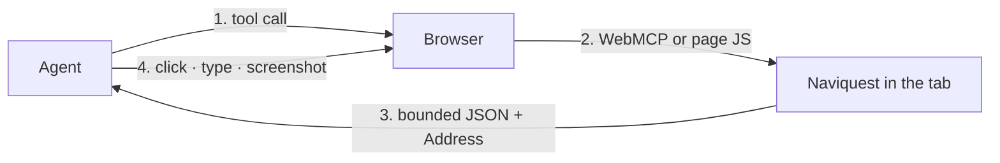
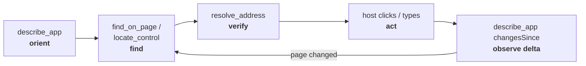
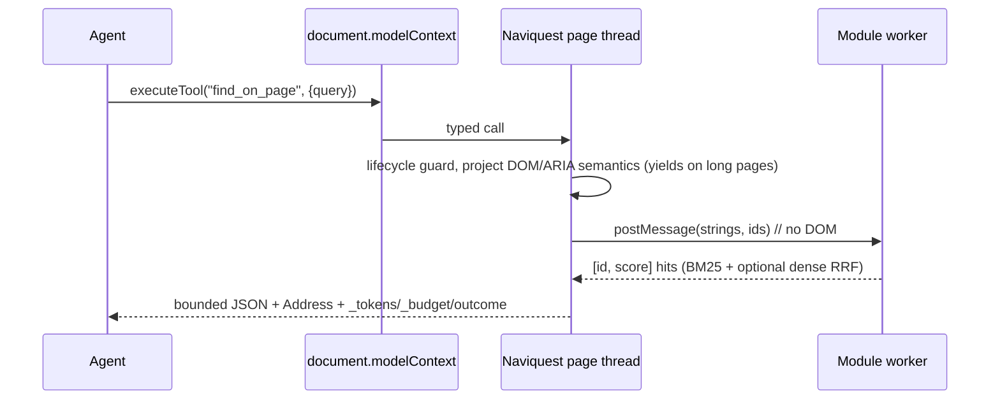

# Naviquest

<p align="center">
  
</p>

**A browser-research SDK for WebMCP sites and standalone automation.** Embed
Naviquest to register tools and declare first-party guidance, or inject the same
SDK from a browser host to research an unmodified origin with bounded, sourced,
re-resolvable answers instead of a DOM dump.

## Why this exists: web research burns the context window

An agent that needs **one sentence** from a page is usually handed **the whole
page**. A raw DOM snapshot runs 10k-125k+ tokens, and 42% of them exceed a 128k
context window outright ([D2Snap](https://arxiv.org/abs/2508.04412)); even an
accessibility tree stays above 15k. The model then re-reads that dump on every
step, and its DOM references go stale the moment the page changes.

That cost is structural, not incidental: **it grows with the page**. A research
loop over ten large pages spends most of its context on markup it never quotes.

### The idea: make the browser the research layer, with optional developer hints

The page is already fetched, parsed, styled, and semantically annotated inside
Chromium. So do the research *there*. Naviquest projects the live DOM and ARIA
state, retrieves relevant evidence inline or in an optional worker, grounds it
on the page thread, and hands back only a **bounded answer plus a semantic
address** the agent can resolve again later. The page itself never enters the
model's context. A developer can register the SDK on a site and add optional
first-party hints for known routes, tasks, and safety constraints. Naviquest
returns the semantic navigation target; the agent's browser host follows it.

### Bounded retrieval, not a universal token claim

| | Whole‑page approach | Browser as the research layer |
|---|---|---|
| What the model receives | the fetched page or snapshot | one budgeted response, followed by more calls only when needed |
| Cost as the page grows | usually grows with the page | each response has a tool-specific cap; a broad task can still need many calls |
| After the page changes | re-read the dump; DOM refs stale | re-resolve a semantic address |
| Where the work happens | your context, your backend | the tab, on device |

Token use depends on the page structure, the question, and the host's browsing
strategy. Bounded retrieval can reduce context on large, structured, text-heavy
pages. On a small page, a weakly structured page, or a broad site audit, the
extra calls can cost as much as or more than direct fetch. The live sensor and
its known gaps are documented in [docs/EVAL.md](./docs/EVAL.md).

## What Naviquest is

Naviquest is a **client-side JavaScript SDK** for agentic web research. It
publishes six tools through [WebMCP](https://webmachinelearning.github.io/webmcp/)
- orient, find, locate a control, resolve an address, query, and discover what an
origin offers agents; every one of them returns a budgeted result.

One implementation supports two deployment modes:

| Mode | Who configures it | What Naviquest provides |
|---|---|---|
| **Developer SDK** | The website or web-app developer | WebMCP tool registration plus optional first-party purpose, task, and privacy hints. |
| **Standalone browser research** | An automation or browser host | The same tools injected into an unmodified origin, using only live DOM and ARIA evidence. |

The developer mode makes an app's known routes and safety constraints clearer to
an agent. The standalone mode needs no page markup or custom API. In both modes,
Naviquest returns evidence and a semantic target; the browser host performs
navigation and actions.

**No model is required.** Retrieval is deterministic: DOM/ARIA semantic
projection, BM25 with heading weighting, and structural priors, all with no
download and no flag. Chrome's on-device AI is a progressive enhancement
layered on top, and every AI lane fails open to that lexical baseline.

### Designed for websites, automations, and web apps

- **Websites:** embed the SDK for first-party and in-app agents.
- **Automation:** inject the same bundle into an unmodified page on any origin.
- **Web applications:** register six WebMCP tools or call the same developer-facing JavaScript API directly, even when `document.modelContext` is unavailable. Optional first-party `orientation` and `exclude` metadata make known routes, tasks, and protected content explicit; generic DOM and ARIA retrieval does not require them.
- **Agent resources:** discover same-origin `llms.txt` and `llms-full.txt` manifests, search and retrieve their declared resources, and fall back to live page links when no manifest exists.

Naviquest builds on existing browser and agent conventions instead of replacing them.

Tool budgets cap an individual response; they do not cap the cost of a full
research task. If a minimum valid record cannot fit, Naviquest returns the
smallest valid payload and declares `_overBudget` instead of silently
truncating it.

**Why now.** WebMCP is standardizing a page‑side tool boundary and Chrome is shipping on‑device Gemini Nano. These primitives now make in-browser agentic research possible, and Naviquest is the retrieval layer that uses them.

No backend. No keys. No prebuilt crawl. Runs on any origin; every AI lane fails open to a lexical baseline.

## Methodological origin

Naviquest applies methods I learned while creating [Octocode.ai](https://github.com/bgauryy/octocode), an agentic code-research platform built to find, understand, and prove context without flooding an agent's token window. Octocode's research loop-**orient → search → read exact evidence → prove → decide**-became Naviquest's browser loop-**orient → find → resolve → act → observe**.

The two projects share four principles: progressive disclosure instead of bulk ingestion, bounded outputs, source references the agent can revisit, and explicit gaps instead of confident guesses. Octocode is not a Naviquest runtime dependency; it is where I developed and tested these agentic-research methodologies before adapting them to live web pages.

## Integrate Naviquest in your site

Install the `naviquest` package in your web application. Create one SDK instance
after the page's application root exists, then call `register()`. Registration
publishes the six WebMCP tools when the browser exposes `document.modelContext`.
The returned SDK remains usable through JavaScript when WebMCP is unavailable.

```ts
import { createNaviquest } from 'naviquest';

export const naviquest = await createNaviquest({
  root: 'main',
  exclude: ['[data-private]'],
  orientation: {
    purpose: 'Residents can review parking permits and start a renewal.',
    tasks: [{
      name: 'Renew a parking permit',
      locate: '#renew-permit',
      how: 'Opens the renewal form.',
    }],
    constraints: ['Do not submit payment details. Hand off to the resident.'],
    view: () => document.querySelector('[aria-current="page"]')?.textContent,
  },
});

await naviquest.register();
```

### Add it to every page

For a multi-page application, import the same bootstrap module from every HTML
page entry. Each full navigation creates a new document, so each document needs
its own instance and WebMCP registration. CityDesk follows this pattern with
[`packages/demo-app/src/main.ts`](./packages/demo-app/src/main.ts).

For a single-page application, create one instance after the root mounts.
Naviquest observes DOM changes and rebuilds its index before the next tool call.
Use `orientation.view` only for route or view state that the live accessibility
tree does not already expose. Call `naviquest.dispose()` when the application
root is permanently removed.

### Configure the SDK

`createNaviquest()` accepts the following top-level options.

| Option | Use it for | Behavior |
|---|---|---|
| `root` | Select the application content boundary. | Indexes that element and reports coverage against it. |
| `rootFallbacks` | Replace the automatic primary-content selector cascade. | Selects an alternative root when `root` is omitted. |
| `exclude` | Protect private or irrelevant regions. | Never walks, indexes, or returns matching content. |
| `redact` | Remove sensitive text as a last check. | Receives the text and source element during projection. |
| `locale` | Pin the retrieval locale. | Otherwise follows `<html lang>` on each rebuild. |
| `worker` | Move index construction and ranking off the page thread. | Uses a module worker; the tool API remains asynchronous. |
| `workerFactory` | Provide a custom worker constructor. | Replaces the standard module-worker construction. |
| `dense` | Enable the optional dense retrieval lane. | Requires `worker: true`; `"eager"` starts warming immediately. |
| `denseBase` | Set the dense-model asset location. | Defaults to `./model/`. |
| `autoReindex` | Control automatic page-change indexing. | Set `false` only when your application calls `reindex()` itself. |
| `onIndex` | Observe index rebuilds. | Receives fresh `IndexStats`. |
| `onIntent` | Surface a one-line agent reason in your UI. | Receives the tool and untrusted reason text; render it as text, never HTML. |
| `orientation` | Add first-party application guidance. | Returns a provenance-tagged `authored` block from `describe_app()`. |
| `tuning` | Override retrieval, projection, and response limits. | Uses the documented `PartialTuning` shape from [`config.ts`](./packages/naviquest/src/config.ts). |

`orientation` is optional and belongs only to a site you own. It adds product
knowledge to the generic DOM and ARIA model; it does not replace live landmarks,
outline, or control state. `find_on_page` does not search hints as page evidence.

| `orientation` field | Purpose | Result |
|---|---|---|
| `purpose` | State what the application is for. | `authored.purpose` |
| `tasks` | Declare a known task and stable CSS selector. | Validated `authored.tasks` |
| `tasks[].how` | Explain the task entry point. | Included with that task |
| `constraints` | State a safety or handoff rule. | `authored.constraints` |
| `view` | Expose SPA state when `aria-current` is unavailable. | A bounded live value, or an omission when absent or failing |

The SDK accepts a task selector only when it is valid CSS, reaches an element,
and stays outside `exclude`. Otherwise it omits the task and reports why. An
agent copies `authored.tasks[].locate` into `query_selector({ selector })` to
inspect the live control and receive its address. For an unknown task, it uses
`locate_control`. Naviquest returns the grounded target; the browser host decides
whether to navigate, click, type, or submit.

For standalone research on a site you do not own, omit `orientation`. Generic
injection still orients, finds content, and discovers routes from the live page.
For a full plain-HTML example and direct JavaScript tool use, see
[the package integration guide](./packages/naviquest/README.md#use-it-in-a-page).

---

## Measurement and limits

The project measures behavior against reference and live pages, including
budgets, addressing, cursor continuity, and retrieval. The measured strengths,
failures, and methodology are in [docs/EVAL.md](./docs/EVAL.md).

These checks establish behavior for their pages and questions; they do not
support a general conclusion about answer quality or token use. Page structure,
a host's navigation policy, and the number of calls needed to answer the task
all affect the result. In particular, a fetch loop can be cheaper for a short,
static page, while bounded retrieval is most useful when a large page is
repeatedly sent to a model.

Live-site measurements also vary between runs. A page can serve different source
payloads, render content after a fetch, or change its navigation surface. Compare
quality, total context, and largest response under a frozen task; do not turn one
site or one run into a general efficiency claim.

---

## How it works

The agent runs one continuous loop (**orient → find → resolve → act → observe**) and never serializes the page:



<p align="center">
  
</p>

Inside the tab, each call derives a semantic projection from live DOM and ARIA state, then ranks segmented passages and extracts the answering sentence. It attaches a re-resolvable address, caps the payload, stamps freshness cursors, and names the next tool. Naviquest never leaves the origin and never clicks; the host does that.

**The six tools:** five answer questions about *this page*; `agentic_content` answers about *this origin*:

| Tool | Question it answers | Returns |
|---|---|---|
| `describe_app` | Where am I, and what changed? | Landmarks, outline, modality, coverage, vocabulary |
| `find_on_page` | What does this page say about X? | Ranked passages + addresses + one supported‑sentence `answer` |
| `locate_control` | Which control performs this job? | Ranked live controls with state, confidence, affordances |
| `resolve_address` | Can I act on this identity now? | Live identity, state, navigation target, bounding box |
| `query_selector` | What can I do or see? | Semantic inventories, or guarded exact CSS matches |
| `agentic_content` | What does this origin publish for agents? | `llms.txt` resources or live page links with `urlSemantics` |



Every response carries an `outcome` (`success` · `degraded` · `ambiguous` · `not_found` · `error`) and separates evidence from guesses: only `answer` is an answer; `confidence` and `coverage` say how well the query was covered and what was unreachable. Wire shapes: [TOOLS.md](./docs/TOOLS.md).

**Smart retrieval, zero download:** DOM/ARIA semantic projection, heading/landmark segmentation, Okapi BM25 with heading weighting, exact + fuzzy recovery, and structural priors (demote nav/banner/citations) rank passages with no flag and no model. Details: [ARCHITECTURE.md](./ARCHITECTURE.md).

**On-device AI, where the browser exposes it:** each lane is opt-in and fails open:

| Chrome API | Naviquest use | Status |
|---|---|---|
| **Prompt API** (`LanguageModel`) | Answer **verifier** (gates whether an extractive `answer` is *asserted* vs `unsupported`) | Shipped |
| **Prompt API (multimodal)** | Opaque‑region **describer** (reads a `<canvas>` chart or unlabeled `` the text walk cannot) | Shipped |
| **Summarizer API** | `summarize` option (compresses returned text further; addresses survive) | Shipped |
| **Semantic Embedder** | Dense-lane provider behind the RRF-fusion seam (query/document embeddings) | Design only ([plan](./docs/SEMANTIC-EMBEDDER.md)) |

Naviquest remains under active improvement. Its direction is to use more
browser-provided AI capabilities where they are available and measurable, while
keeping deterministic retrieval as the fallback. The Semantic Embedder is a
design, not an implemented feature; its adoption criteria are in
[docs/SEMANTIC-EMBEDDER.md](./docs/SEMANTIC-EMBEDDER.md).

Verified on Chrome 152. Chrome's built‑in AI: [developer.chrome.com/docs/ai/built-in](https://developer.chrome.com/docs/ai/built-in). More: [Built‑in AI details](./docs/TECHNOLOGY.md).

Browser AI is optional. It can improve coverage of difficult content, but it can
also add setup time and tokens. Measure it for the target browser and workload
before treating it as an improvement.

---

## Deployment modes

Two deployment modes, one implementation:

| | **Websites** | **Automations** |
|---|---|---|
| You own | the HTML | the browser session |
| Serves | visitors' / in‑app agents | any origin you can open |
| You ship | `createNaviquest()` + `register()` | the injected SDK bundle |
| Page markup | optional `orientation` / `exclude` | none required |

For a site you own, install the published `naviquest` package with your package
manager and use the [`createNaviquest` integration API](#integrate-naviquest-in-your-site).
The lexical tools work after the SDK loads; WebMCP registration and on-device AI
remain optional.

For standalone research, a browser host can inject the same bundled SDK before
an unmodified page loads. No site markup or first-party metadata is required.
The host chooses its browser integration and owns navigation, clicks, typing,
and screenshots. Naviquest returns the semantic target, live state, box, and
navigation provenance for the host to act on. It reports page-JavaScript gaps,
including privileged input and cross-origin frames, in `coverage`.

---

## Runtime requirements

Naviquest runs in a browser page. Calling the returned SDK object directly does
not require WebMCP. `register()` publishes the tools only when the browser
provides `document.modelContext`.

Browser-provided AI is optional. Naviquest keeps deterministic retrieval as the
fallback when those APIs or their models are unavailable. Test the browser and
workload you support before depending on an AI-assisted result.

## Under the hood

Projection and address resolution stay on the main thread. Retrieval runs inline by default; with `worker: true`, index construction and ranking move to a module worker, and only strings, ids, scores, and exact offsets cross the boundary-never DOM nodes. Freshness is a union of observation signals (`MutationObserver`, `slotchange`, `toggle`, frame `load`, `document.fonts`) plus two bounded cursors (`_etag` for payloads, `_observation` for semantic state). One worker-enabled tool call, end to end:



Full pipeline, the exact web APIs used (and the ones deliberately avoided), and the freshness model: [ARCHITECTURE.md](./ARCHITECTURE.md) · [TECHNOLOGY.md](./docs/TECHNOLOGY.md).

## Reference

| Document | Purpose |
|---|---|
| [ARCHITECTURE.md](./ARCHITECTURE.md) | Projection, segmentation, retrieval, addressing |
| [docs/TOOLS.md](./docs/TOOLS.md) | Tool purposes and wire contracts |
| [docs/TECHNOLOGY.md](./docs/TECHNOLOGY.md) | Web APIs used and why |
| [docs/SEMANTIC-EMBEDDER.md](./docs/SEMANTIC-EMBEDDER.md) | Semantic Embedder integration criteria |
| [docs/EVAL.md](./docs/EVAL.md) | Cost and gaps |
| [docs/EVIDENCE.md](./docs/EVIDENCE.md) | Why web agents fail and what this layer targets |

## Status and limits

Naviquest is under active improvement and is not production-hardened. It has no
universal claim to lower token use, faster research, or better answers. Measure
the target website and task: the result depends on its structure, the agent's
strategy, and how many pages or tool calls the work requires.

The SDK can discover and ground same-origin destinations, but the browser host
performs navigation, clicking, typing, and screenshots. A site that exposes
first-party orientation metadata or its own WebMCP action tools can make routes
and task semantics less ambiguous. Those integrations can improve navigation
for that site; they are optional and do not replace the generic DOM and ARIA
path.

The project evaluates browser-layer AI capabilities for measured tasks. A
capability must improve a measured task and retain a deterministic fallback
before it becomes part of the default path.

> ⚠️ **Security.** The current focus is retrieval and navigation **quality**, not a hardened security boundary. Returned page text is marked `untrustedContentHint` and the host can `exclude` / `redact`, but this has **not** been audited against adversarial pages-for example, accessibility‑tree prompt injection. Do not rely on it as a trust boundary in a hostile context yet; treat all returned page content as untrusted and validate it host‑side.

## License

[MIT](./LICENSE). The bundle includes `dom-accessibility-api` (MIT); the notice is in the bundle banner.
