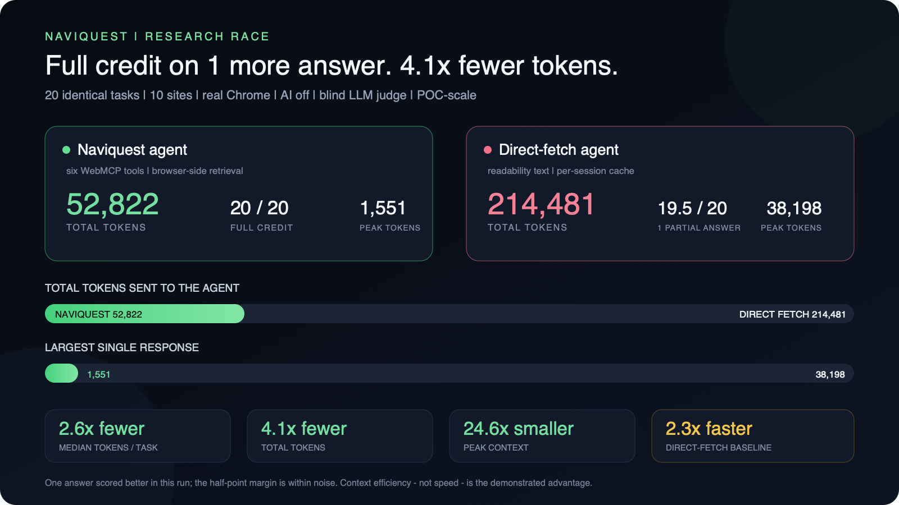
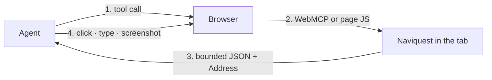
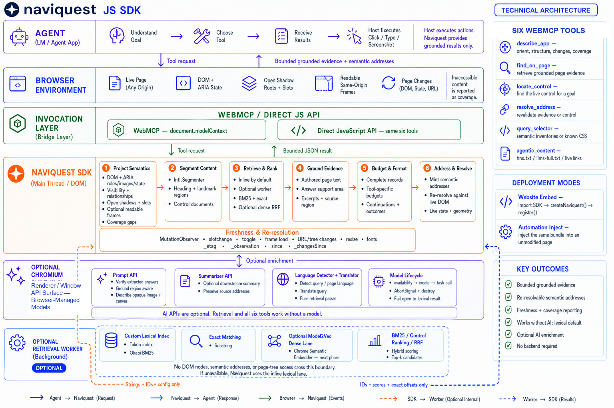
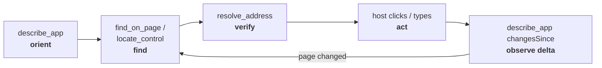
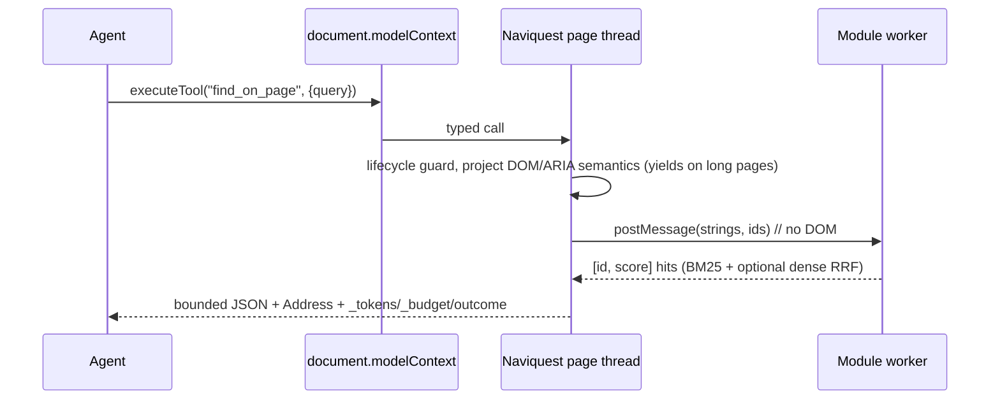

# Naviquest

<p align="center">
  
</p>

**Turn the browser into the agent's research engine.** An agent asks the live page a question and gets a bounded, sourced, re-resolvable answer-not a DOM dump.

## Why this exists: web research burns the context window

An agent that needs **one sentence** from a page is usually handed **the whole
page**. A raw DOM snapshot runs 10k-125k+ tokens, and 42% of them exceed a 128k
context window outright ([D2Snap](https://arxiv.org/abs/2508.04412)); even an
accessibility tree stays above 15k. The model then re-reads that dump on every
step, and its DOM references go stale the moment the page changes.

That cost is structural, not incidental: **it grows with the page**. A research
loop over ten large pages spends most of its context on markup it never quotes.

### The idea: make the browser the research layer

The page is already fetched, parsed, styled, and semantically annotated inside
Chromium. So do the research *there*. Naviquest projects the live DOM and ARIA
state, retrieves relevant evidence inline or in an optional worker, grounds it
on the page thread, and hands back only a **bounded answer plus a semantic
address** the agent can resolve again later. The page itself never enters the
model's context.

Move the work, and the cost stops scaling:

| | Whole‑page approach | Browser as the research layer |
|---|---|---|
| What the model receives | the page (10k-125k+ tokens) | a budgeted answer (**~1-2k** target) |
| Cost as the page grows | grows with it | **flat** |
| After the page changes | re-read the dump; DOM refs stale | re-resolve a semantic address |
| Where the work happens | your context, your backend | the tab, on device |

In a head-to-head race of two real agents over 20 questions on 10 large sites,
that came to **4.1× fewer tokens**, and a largest single payload **24.6×
smaller**. Naviquest earned full credit on the one question where direct fetch
received partial credit, producing a 20/20 against 19.5/20 scoreline. The
half-point margin remains within the noise of this POC-scale run.
[See the benchmark](#benchmark--two-real-agents-the-same-20-questions).

## What Naviquest is

Naviquest is a **client-side JavaScript SDK** for agentic web research. It
publishes six tools through [WebMCP](https://webmachinelearning.github.io/webmcp/)
- orient, find, locate a control, resolve an address, query, and discover what an
origin offers agents; every one of them returns a budgeted result.

**No model is required.** Retrieval is deterministic: DOM/ARIA semantic
projection, BM25 with heading weighting, and structural priors, all with no
download and no flag. Chrome's on-device AI is a progressive enhancement
layered on top, and every AI lane fails open to that lexical baseline.

### Designed for websites, automations, and web apps

- **Websites:** embed the SDK for first-party and in-app agents.
- **Automation:** inject the same bundle into an unmodified page on any origin.
- **Web applications:** register six WebMCP tools or call the same developer-facing JavaScript API directly, even when `document.modelContext` is unavailable. Optional `orientation` and `exclude` metadata tailor the agent's view.
- **Agent resources:** discover same-origin `llms.txt` and `llms-full.txt` manifests, search and retrieve their declared resources, and fall back to live page links when no manifest exists.

Naviquest builds on existing browser and agent conventions instead of replacing them.

> **The trade-off, stated up front.** The direct-fetch agent was **2.3× faster**
> in wall-clock: one `fetch` is a single round-trip, while Naviquest pays page
> navigations and more tool calls. Context efficiency, not speed, is the
> demonstrated advantage.

### Every measurement in this repo, at a glance

The race quoted above is one of four checks. Token counts are estimated
consistently with the same audited estimator: `chars/4` of the full payload the
model receives. Each row names the check that produced it.

| Check | Result |
|---|---|
| **20‑question agent race** *(detail [below](#benchmark--two-real-agents-the-same-20-questions))* | **4.1× fewer tokens**, 20/20 vs 19.5/20 on quality |
| 4‑question reference set · `yarn eval --live` | **14.2× fewer** than `ariaSnapshot` (5,481 vs 77,932), answering 3/4 to its 4/4 |
| Re‑read after nothing changed · [EVAL.md](./docs/EVAL.md) | **97.6% fewer** tokens (`_etag` delta) |
| Largest measured tool result · `budget-bars.mjs` | **1,536 tokens** against a 2,000-token budget |

Tool budgets keep response size independent of page size. If a minimum valid
record cannot fit, Naviquest returns the smallest valid payload and declares
`_overBudget` instead of silently truncating it. Small pages can favor direct
fetch: it won both `nodejs.org` questions. Full breakdown:
[eval/RESULTS.md](./eval/RESULTS.md).

**Why now.** WebMCP is standardizing a page‑side tool boundary and Chrome is shipping on‑device Gemini Nano. These primitives now make in-browser agentic research possible, and Naviquest is the retrieval layer that uses them.

No backend. No keys. No prebuilt crawl. Runs on any origin; every AI lane fails open to a lexical baseline.

## Methodological origin

Naviquest applies methods I learned while creating [Octocode.ai](https://github.com/bgauryy/octocode), an agentic code-research platform built to find, understand, and prove context without flooding an agent's token window. Octocode's research loop-**orient → search → read exact evidence → prove → decide**-became Naviquest's browser loop-**orient → find → resolve → act → observe**.

The two projects share four principles: progressive disclosure instead of bulk ingestion, bounded outputs, source references the agent can revisit, and explicit gaps instead of confident guesses. Octocode is not a Naviquest runtime dependency; it is where I developed and tested these agentic-research methodologies before adapting them to live web pages.

## Quick start

```bash
yarn install
yarn dev
```

This starts the CityDesk demo at `http://localhost:5310`. The SDK API used by an embedding site is:

```ts
import { createNaviquest } from 'naviquest';

const naviquest = await createNaviquest();
await naviquest.register(); // No-op when document.modelContext is unavailable.

const hit = await naviquest.tools.find_on_page({ query: 'refund policy' });
// Every tool resolves to a payload OR a ToolFailure. Narrow first: the negative
// branch of `outcome === 'error'` is what removes the failure shape.
if (hit.outcome === 'error') throw new Error(hit.error);
// `error` is the machine-readable class and is readable on both shapes;
// `message` (the recovery instruction) needs `'message' in hit` first.

console.log(hit.answer?.text);        // grounded answer, when one is supported
console.log(hit.results[0]?.text);    // ranked passages
console.log(hit.results[0]?.address); // Resolve this identity again later.
```

Registration is a progressive enhancement, not a precondition: `naviquest.tools.*`
works on the returned object in any browser, and `register()` is what publishes
the same six tools to an agent through WebMCP. Full page integration — bundler
setup, a copy-pasteable plain-HTML page, and the act-on-a-result flow — is in
**[`packages/naviquest/README.md`](./packages/naviquest/README.md#use-it-in-a-page)**.

The lexical tools work without models or feature flags. WebMCP registration and Chrome's on-device AI APIs are progressive enhancements; the [requirements](#requirements) section explains how to enable them.

---

## The proof

> 📊 **All measured results live in [`eval/RESULTS.md`](./eval/RESULTS.md)**: the two‑agent race, the audited token accounting, the offline gates, the two runtime defects the eval caught, and the on‑device‑AI numbers. To reproduce any of it, [`eval/README.md`](./eval/README.md) has the copy‑pasteable commands (including the live dashboard).

### Benchmark: two real agents, the same 20 questions

This is the headline experiment. Two **real LLM agents** answer the **identical**
20 questions (10 `read` + 10 `crawl`) over **10 large pages across 10 distinct
sites** (Wikipedia, Node.js, MDN, Git, Kubernetes, Python, React, Vue,
TypeScript, Rust). One uses Naviquest's six tools; the other uses a
**steelmanned** `fetch` tool (readability‑extracted main content plus a
per‑session cache, not a whole‑page dump). Quality is scored **blind by an LLM
judge on randomized A/B pairs with no gold key**, on questions that demand
complete, specific answers.

| | naviquest | `fetch` baseline | result |
|---|---:|---:|:--|
| **quality (blind judge)** | **20 / 20 full credit** | 19 full + 1 partial (19.5 / 20) | **Naviquest scored better on 1 answer** |
| **total tokens** | **52,822** | 214,481 | **4.1× fewer** |
| tokens / question (median) | - | - | **2.6× fewer** (IQR 2.2-6.3×) |
| **largest single payload** | **1,551** | 38,198 | **24.6× smaller** |
| wall‑clock | 15,176 ms | 6,479 ms | baseline **2.3× faster** |
| tool calls / fetches | 93 | 22 | - |

Naviquest earned full credit on every question while using about one quarter of
the tokens. On one Node.js crawl answer, direct fetch gave two halves of the
same API difference and received partial credit; Naviquest supplied both
requested differences. That is one better-scored answer in this run, not
evidence of a reliable quality advantage. The clear loss is wall-clock: a
`fetch` is a single round-trip, while Naviquest pays page navigations and more
tool calls per crawl.

<p align="center">
  <a href="./eval/RESULTS.md">
    
  </a>
</p>

<p align="center"><sub><b>20 identical tasks across 10 sites.</b> Naviquest received full credit on one more answer; the half-point margin remains within noise. Click for complete results and caveats.</sub></p>

**How it was executed.** Nothing here is simulated. The runtime is the
[`naviquest-chrome-devtools`](./skills/naviquest-chrome-devtools) skill. It
launches a real Chrome, injects the SDK before navigation, and invokes the tools
through the **WebMCP CDP domain**. The measurement is
[`eval/research`](./eval/README.md) (it charges every call, times it, and
streams it to a live dashboard; it contains no browser code at all). That boundary
is deliberate: the eval measures, the skill runs. Reproduce it with the
copy‑pasteable sequence in [eval/README.md](./eval/README.md).

> ⚗️ **This is a POC, and the numbers are a POC‑scale sample** of 20 findings,
> one run, no confidence intervals. Read the half‑point quality margin as this
> run's scoreline rather than a reliable edge: one judgement out of 20 sits
> inside the noise this design can resolve. What the run establishes is **no
> worse quality for a quarter of the tokens**. The budget mechanism does not
> depend on question choice: the largest measured tool result was 1,551 tokens
> against a 38,198-token page. Better
> embeddings, semantic ranking, and broader evals should push all of this
> further.

Chrome's on-device AI lanes were **off** for this run, so the savings come from
projection, retrieval, and response budgets alone. Full method and every caveat:
[METHODOLOGY.md](./eval/research/METHODOLOGY.md) · complete results:
[eval/RESULTS.md](./eval/RESULTS.md).

The complete per-question breakdown and per-tool budget measurements live in
[eval/RESULTS.md](./eval/RESULTS.md). Large pages produced the largest context
savings, while small pages sometimes favored one direct fetch. Repeated reads
also benefit from `_etag` deltas.

---

## How it works

The agent runs one continuous loop (**orient → find → resolve → act → observe**) and never serializes the page:



<p align="center">
  
</p>

Inside the tab, each call derives a semantic projection from live DOM and ARIA state, then ranks segmented passages and extracts the answering sentence. It attaches a re-resolvable address, caps the payload, stamps freshness cursors, and names the next tool. Naviquest never leaves the origin and never clicks; the host does that.

**The six tools:** five answer questions about *this page*; `agentic_content` answers about *this origin*:

| Tool | Question it answers | Returns |
|---|---|---|
| `describe_app` | Where am I, and what changed? | Landmarks, outline, modality, coverage, vocabulary |
| `find_on_page` | What does this page say about X? | Ranked passages + addresses + one supported‑sentence `answer` |
| `locate_control` | Which control performs this job? | Ranked live controls with state, confidence, affordances |
| `resolve_address` | Can I act on this identity now? | Live identity, state, navigation target, bounding box |
| `query_selector` | What can I do or see? | Semantic inventories, or guarded exact CSS matches |
| `agentic_content` | What does this origin publish for agents? | `llms.txt` resources or live page links with `urlSemantics` |



Every response carries an `outcome` (`success` · `degraded` · `ambiguous` · `not_found` · `error`) and separates evidence from guesses: only `answer` is an answer; `confidence` and `coverage` say how well the query was covered and what was unreachable. Wire shapes: [TOOLS.md](./docs/TOOLS.md).

**Smart retrieval, zero download:** DOM/ARIA semantic projection, heading/landmark segmentation, Okapi BM25 with heading weighting, exact + fuzzy recovery, and structural priors (demote nav/banner/citations) rank passages with no flag and no model. Details: [ARCHITECTURE.md](./ARCHITECTURE.md).

**On‑device AI, where the browser exposes it:** each lane is opt‑in and fails open:

| Chrome API | Naviquest use | Status |
|---|---|---|
| **Prompt API** (`LanguageModel`) | Answer **verifier** (gates whether an extractive `answer` is *asserted* vs `unsupported`) | Shipped |
| **Prompt API (multimodal)** | Opaque‑region **describer** (reads a `<canvas>` chart or unlabeled `` the text walk cannot) | Shipped |
| **Summarizer API** | `summarize` option (compresses returned text further; addresses survive) | Shipped |
| **Semantic Embedder** | Dense‑lane provider behind the RRF‑fusion seam (query/document embeddings) | Designed ([plan](./docs/SEMANTIC-EMBEDDER.md)) |

**The one lane deliberately not shipped.** Chrome's experimental Semantic
Embedder could improve paraphrase retrieval without site-shipped model assets,
and Chrome 152 exposed it in a dedicated worker. It remains flag-gated and
unapproved for shipping, so Naviquest has a measured integration contract and
adoption gate-not an implementation. Full plan:
[docs/SEMANTIC-EMBEDDER.md](./docs/SEMANTIC-EMBEDDER.md).

Verified on Chrome 152. Chrome's built‑in AI: [developer.chrome.com/docs/ai/built-in](https://developer.chrome.com/docs/ai/built-in). More: [Built‑in AI details](./docs/TECHNOLOGY.md).

**Measured with the models on.** In a separate paired run, AI-on scored 19.5/20
with 56,284 tokens in 90.2 seconds; AI-off scored 20/20 with 46,891 tokens in
17.8 seconds. Per-document setup dominated the difference. Because the models
added cost without improving quality on this workload, AI-off remains the
default. Details: [eval/RESULTS.md](./eval/RESULTS.md).

---

## Use it

Two deployment modes, one implementation:

| | **Websites** | **Automations** |
|---|---|---|
| You own | the HTML | the browser session |
| Serves | visitors' / in‑app agents | any origin you can open |
| You ship | `createNaviquest()` + `register()` | the injected SDK bundle |
| Page markup | optional `orientation` / `exclude` | none required |

The [quick start](#quick-start) shows the website-embed path. The lexical tools work immediately after the SDK loads; WebMCP registration and on-device AI remain optional.

**Automation inject (raw CDP, no Playwright)**: the recommended automation path uses the [`naviquest-chrome-devtools`](./skills/naviquest-chrome-devtools) skill:

```bash
SKILL=skills/naviquest-chrome-devtools
node $SKILL/scripts/naviquest-build.mjs
node $SKILL/scripts/open-browser.mjs --headless --port 9222 --enableFeatures WebMCPTesting --url "https://example.com"
NQ_ACTION=call NQ_TOOL=find_on_page NQ_INPUT='{"query":"what is this domain used for"}' \
  node $SKILL/scripts/cdp-sandbox.mjs $SKILL/scripts/cdp-checks/naviquest.mjs --port 9222 --target-url example.com --keep-tab
```

The SDK is a plain IIFE, so any host injects it before navigation:

| Automation tool | Injection hook |
|---|---|
| Chrome DevTools Protocol | `Page.addScriptToEvaluateOnNewDocument` |
| Playwright | `context.addInitScript({ content })` |
| Puppeteer | `page.evaluateOnNewDocument(script)` |
| Selenium / WebDriver BiDi | `script.addPreloadScript` |
| A website you own | `import { createNaviquest }` + `register()` |

The host owns navigation, clicks, typing, and screenshots, and Naviquest returns the semantic target, live state, box, and navigation provenance for it to act on. What page JS cannot do (privileged input, cross‑origin frames, screenshots) is reported in `coverage`, never silently omitted.

---

## Requirements

Core SDK: a **WebMCP‑capable browser**. `document.modelContext` is not in stock Chrome, so enable `chrome://flags/#enable-webmcp-testing` and relaunch. It runs on any origin; repo tooling needs **Node 22+** and **Google Chrome**.

The implemented on-device AI lanes need their model channels enabled. Either set them in `chrome://flags` on a persistent profile (`#prompt-api-for-gemini-nano` and `#optimization-guide-on-device-model` = *Enabled BypassPerfRequirement*), or pass them on the command line:

```
--enable-features=OptimizationGuideOnDeviceModel,PromptAPIForGeminiNano,SummarizationAPIForGeminiNano,TranslationAPI,LanguageDetectionAPI
```

Desktop only. **Built-in AI works under headless CDP automation; visible Chrome is not required.** On Chrome 152 headless, a cold `LanguageModel` downloaded in 54.8 seconds. After warm-up, `find_on_page` returned an on-device `verified` answer on a live Wikipedia article. Visible mode is useful only when a person must complete authentication or another UI flow.

The flags apply only to a fresh Chrome process. The
[`naviquest-chrome-devtools`](./skills/naviquest-chrome-devtools) skill documents
browser-hosted research, model warm-up, and AI-enabled runs. The default
research run is AI-off and needs no model warm-up.

## Run this repository

```bash
yarn install
yarn dev            # CityDesk demo on :5310
yarn build          # SDK dist/ + demo
yarn typecheck
yarn eval           # every offline gate (real Chromium, ~2s); --live adds the network probe
yarn research       # multi-page race, AI off; AI_MODE=on uses a warmed Chrome-skill host
```

`yarn research` only starts the harness and its dashboard. The race itself is two
agents driving it. Full sequence (skill host → harness → two agents → blind judge →
report), plus the visible-Chrome + warm-model variant for AI-on runs:
**[`eval/README.md`](./eval/README.md)**. Results: **[`eval/RESULTS.md`](./eval/RESULTS.md)**.

| Path | Contents |
|---|---|
| `packages/naviquest/` | `naviquest`, the publishable package |
| `packages/demo-app/` | CityDesk, the website‑embed demo |
| `eval/` | offline gates + the two-agent research race (`eval/research/`); results in [`eval/RESULTS.md`](./eval/RESULTS.md), how to run in [`eval/README.md`](./eval/README.md) |
| `skills/naviquest-chrome-devtools/` | the inject over raw CDP, with an offline grader (~12s) |

## Under the hood

Projection and address resolution stay on the main thread. Retrieval runs inline by default; with `worker: true`, index construction and ranking move to a module worker, and only strings, ids, scores, and exact offsets cross the boundary-never DOM nodes. Freshness is a union of observation signals (`MutationObserver`, `slotchange`, `toggle`, frame `load`, `document.fonts`) plus two bounded cursors (`_etag` for payloads, `_observation` for semantic state). One worker-enabled tool call, end to end:



Full pipeline, the exact web APIs used (and the ones deliberately avoided), and the freshness model: [ARCHITECTURE.md](./ARCHITECTURE.md) · [TECHNOLOGY.md](./docs/TECHNOLOGY.md).

## Documentation

| Document | Purpose |
|---|---|
| [ARCHITECTURE.md](./ARCHITECTURE.md) | Projection, segmentation, retrieval, addressing |
| [docs/TOOLS.md](./docs/TOOLS.md) | Tool purposes and wire contracts |
| [docs/TECHNOLOGY.md](./docs/TECHNOLOGY.md) | Web APIs used and why |
| [docs/SEMANTIC-EMBEDDER.md](./docs/SEMANTIC-EMBEDDER.md) | Next phase: measured Chrome Semantic Embedder integration |
| [eval/RESULTS.md](./eval/RESULTS.md) | **All measured results**: the race, token audit, gates, and what the eval found |
| [eval/README.md](./eval/README.md) | **How to run every eval**: gates, live sensors, and the two‑agent race with its dashboard |
| [docs/EVAL.md](./docs/EVAL.md) | Cost and gaps |
| [eval/research/METHODOLOGY.md](./eval/research/METHODOLOGY.md) | The multi‑page research race: design, checks, reproduce |
| [docs/EVIDENCE.md](./docs/EVIDENCE.md) | Why web agents fail and what this layer targets |
| [AGENTS.md](./AGENTS.md) · [DEV.md](./DEV.md) | What to preserve · how to change code |

## Status and disclaimers

> 🧪 **This is a POC.** In the measured two-agent race, Naviquest used **2.6× fewer median tokens per question and 4.1× fewer total tokens** while scoring **20/20 to the baseline's 19.5/20** on blind-judged quality, without a prebuilt external index or prior crawl. It is not production-hardened, and the numbers are a POC-scale sample. Better embeddings, semantic ranking, and broader evals may improve it further.

> ⚠️ **Security.** The current focus is retrieval and navigation **quality**, not a hardened security boundary. Returned page text is marked `untrustedContentHint` and the host can `exclude` / `redact`, but this has **not** been audited against adversarial pages-for example, accessibility‑tree prompt injection. Do not rely on it as a trust boundary in a hostile context yet; treat all returned page content as untrusted and validate it host‑side.

## License

[MIT](./LICENSE). The bundle includes `dom-accessibility-api` (MIT); the notice is in the bundle banner.
