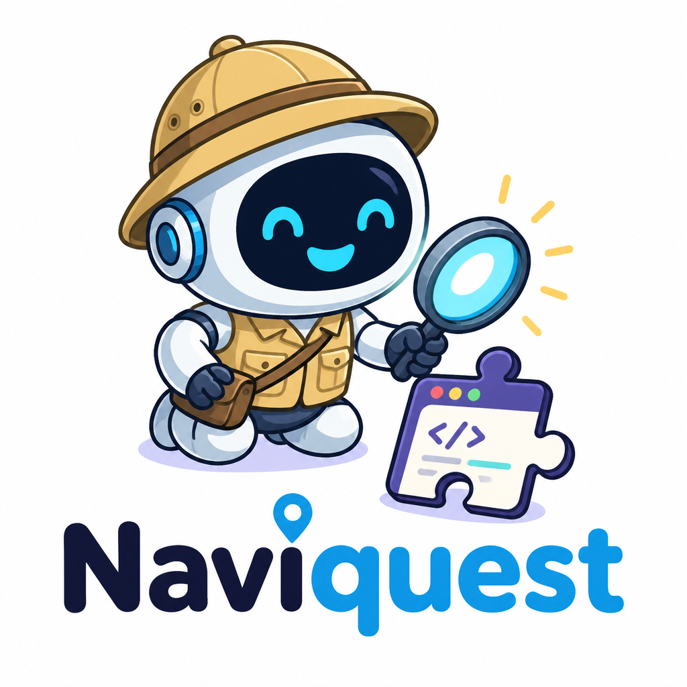
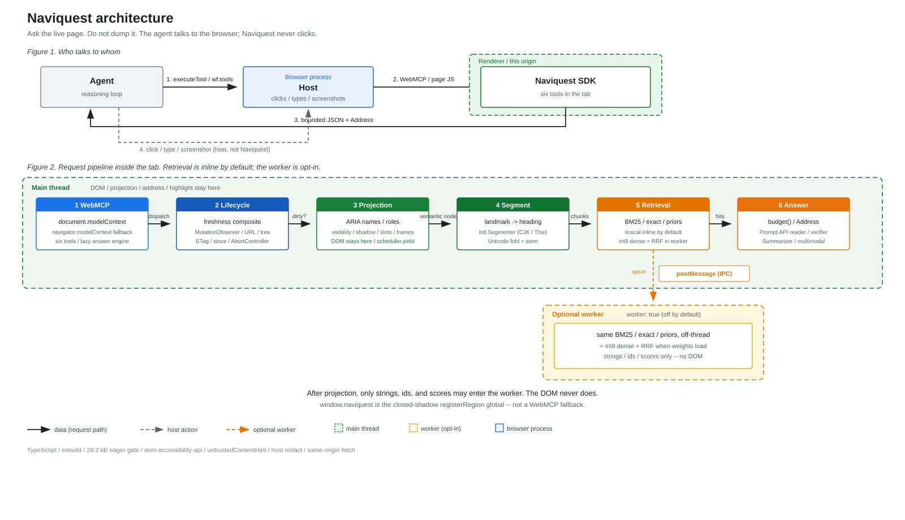

# @naviquest/core

<p align="center">
  
</p>

**The intelligent navigation layer for the agentic web.**

Web agents usually navigate from accessibility snapshots, screenshots, or
extracted page text. These representations can carry far more context than the
current step needs. In an interactive loop, the model repeatedly interprets
them to find evidence, identify controls, and recover from page changes.

Naviquest changes the interface: **navigation becomes a runtime capability**.
Agents ask the live page instead of repeatedly ingesting and interpreting it.

The SDK exposes six focused, token-budgeted tools through
[WebMCP](https://webmachinelearning.github.io/webmcp/). Instead of one large page
read, the agent follows a continuous loop: orient, retrieve, locate, resolve,
act, and verify. Each call returns the evidence, live target, and next step needed
for that moment.

A website can embed Naviquest directly, or an automation platform can inject the
same SDK into an arbitrary origin without custom page markup. Projection,
retrieval, and grounding run inside the browser; Naviquest does not require a
server to process page content.

Through Naviquest, an agent can:

- Understand the page's identity, structure, vocabulary, modality, and coverage.
- Retrieve focused evidence without loading the full HTML or a complete page
  snapshot into model context.
- Find controls by their intended job instead of guessing labels or selectors.
- Enumerate actions, forms, regions, readable scopes, and known CSS matches.
- Resolve a target immediately before acting, with fresh state, viewport
  position, navigation data, and a last-resort selector.
- Discover and read same-origin agent resources, linked pages, and sitemaps.
- Observe meaningful changes after an interaction without rereading the page.

The automation host remains responsible for clicks, typing, navigation, and
screenshots. Naviquest provides the evidence and live targets needed to perform
those actions.

## The thesis: navigation is a bounded loop, at any page size

Understanding a large page is treated today as a context problem—load the HTML or
the accessibility tree and let the model find the answer and the control inside
it, every turn. That representation grows without bound: the WAI-ARIA
specification is a 318,000-token accessibility snapshot that does not fit most
context windows at all.

Naviquest's thesis is that navigation is instead a **bounded, re-resolvable
loop**, and the loop is the same whether the target is one section or a
thousand-page site:

- **On a page:** orient → retrieve → locate → **resolve** (a live, re-resolvable
  address) → the host acts → verify the change.
- **Across a site:** discover a same-origin resource → the host navigates →
  Naviquest **re-indexes the new page** → retrieve again.

Every step costs a bounded budget—roughly 2,000 tokens per tool call—**regardless
of how large the page is**. Measured across live sites: the same
understand-and-act task costs Naviquest ~2,245 tokens on WAI-ARIA where a full
accessibility snapshot is 318,765 (a 142× reduction), and the cross-page loop
followed a discovered same-origin resource and retrieved content on 9 of 10 large
sites tested. The advantage is not a constant factor—it *grows with page size*,
because Naviquest's cost is fixed to the task while the alternatives scale with
the page. That is what makes a large or multi-page site tractable for an agent
rather than an open context problem. Sensors: [`eval/`](../../eval)
(`with-without-measure.mjs`, `ten-large-crawl.mjs`, `action-eval.mjs`).

## A hybrid navigation engine

At runtime, Naviquest combines browser semantics, lexical retrieval, semantic
retrieval, built-in AI, and live page state in one navigation pipeline:

- **WebMCP tool boundary.** Six typed tools give the agent a compact navigation
  interface while the page retains its DOM, index, and implementation details.
- **Semantic projection.** Accessibility roles, names, landmarks, headings,
  relationships, form state, structured data, and readable text become a
  compact, heading-aware representation.
- **Live browser state.** Visibility, modality, DOM identity, viewport geometry,
  navigation targets, shadow roots, and readable frames ground results in the
  interface open in the browser.
- **Hybrid retrieval.** Exact matching and BM25 provide a deterministic lexical
  floor. Compact int8 Model2Vec embeddings add semantic recall, and reciprocal
  rank fusion combines both result sets.
- **Built-in browser AI.** Chrome's Prompt API verifies extracted answers, reads
  top-ranked regions when vocabulary differs, and describes supported image or
  canvas regions. The Summarizer API condenses bounded, grounded evidence while
  preserving provenance and a path back to the original text.
- **Re-resolvable addresses.** Results carry semantic addresses instead of
  stored DOM references or long-lived selectors. Naviquest resolves them against
  the current document immediately before the host acts.
- **Change awareness.** Mutation, slot, toggle, frame, URL, viewport, and
  semantic observations keep the page model fresh and report what changed.

The agent receives focused content, actionable targets, explicit coverage gaps,
and useful next calls—not an overwhelming dump of HTML.

## One SDK, two integration paths

Two callers, one implementation:

1. **Website.** Install `@naviquest/core`, call `createNaviquest()`, and register
   the tools on `document.modelContext`. The site can also provide first-party
   orientation or exclude private regions.
2. **Automation platform.** Inject the same SDK before navigation. The page does
   not need to integrate Naviquest or add special markup. See
   [Test Naviquest](../../docs/TESTING.md) for the injection path.

One SDK and one semantic index provide the same navigation interface in both
cases.

Naviquest returns bounded data and a re-resolvable address. The automation host,
not Naviquest, performs browser input:



This directory contains the repository's only publishable package. The
[CityDesk demo](../../apps/demo), [evaluation sensors](../../eval),
[architecture](../../ARCHITECTURE.md), [browser API map](../../docs/TECHNOLOGY.md),
and [tool wire contract](../../docs/TOOLS.md) document the rest of the system.

## Install

```bash
yarn add @naviquest/core
```

```ts
import { createNaviquest } from '@naviquest/core';

const wf = await createNaviquest();
const registration = await wf.register();
if (!registration.registered) {
  throw new Error(registration.reason ?? 'Naviquest registration failed');
}
await wf.tools.find_on_page({ query: 'refund policy' });
```

Always `await createNaviquest(...)`. Tool calls return promises in every
retrieval lane. `worker: true` moves indexing into a module worker without
changing the return type.

Registration is atomic: all six WebMCP tools become available, or the attempt
rolls back so the caller can retry it. All tools also accept an optional one-line
`reason`; a site can surface it through `createNaviquest({ onIntent })` without
adding it to the page index.

`orientation` and `exclude` let a website add first-party context and privacy
boundaries. They are not required: an injected SDK navigates from the live page
structure. A website can declare its purpose and known CSS locators as follows:

```ts
const wf = await createNaviquest({
  root: '#app',
  exclude: ['[data-private]'],
  orientation: {
    purpose: 'This app lets residents apply for parking permits.',
    tasks: [{ name: 'Start an application', locate: '#apply-permit' }],
  },
});
await wf.register();
const page = await wf.tools.describe_app();
// page.authored is omitted unless orientation was passed
// page.authored?.tasks[0].locate → query_selector({ selector })
```

Published exports:

| Specifier | Development | Default |
|---|---|---|
| `@naviquest/core` | `src/index.ts` | `dist/index.js` + `dist/index.d.ts` |
| `@naviquest/core/worker` | `src/worker.ts` | `dist/worker.js` + `dist/worker.d.ts` |

`window.naviquest` is the only documented global (closed-shadow `registerRegion`). There is no `window.__*` seam.

## Six tools

The six tools form a continuous navigation loop rather than a one-shot page
read:

| Tool | Agent question | Result |
|---|---|---|
| `describe_app` | Where am I, and what is here? | Page identity, structure, modality, vocabulary, coverage, and an observation baseline |
| `find_on_page` | What does this page say about my goal? | Ranked passages, evidence addresses, next calls, and a grounded answer |
| `locate_control` | Which control performs this job? | Ranked live controls with state, context, confidence, and refinements |
| `resolve_address` | Can I read or act on this result now? | Full region text, or fresh control state, box, navigation data, and a last-resort selector |
| `query_selector` | What actions, forms, regions, scopes, or exact CSS matches exist? | Bounded semantic inventories or guarded exact inspection |
| `agentic_content` | Does the answer live elsewhere on this site? | Same-origin agent resources and verified live-page continuations |

The normal flow is:

1. Call `describe_app` to orient.
2. Use `find_on_page`, `locate_control`, or `query_selector` for the task.
3. Copy the returned address into `resolve_address` immediately before reading
   or acting.
4. Let the automation host perform the action.
5. Pass the previous observation to `describe_app({ changesSince })` to inspect
   the outcome.

Use `agentic_content` when the required evidence is on another page of the same
site. Region reading is part of `resolve_address` through `expand` or
`resolveWith: 'read_region'`. Use `describe_app({ opaque: true })` to locate
meaningful regions that the text index cannot read. See the
[tool schemas](./src/tool-specs.ts) for the complete wire surface.

## Retrieval lanes

| Lane | How to get it | Default? |
|---|---|---|
| Inline lexical BM25 | `createNaviquest()` | Yes |
| Worker lexical | `{ worker: true }` or demo `?worker=1` | No — scheduling, not a faster index |
| Hybrid (BM25 + int8 dense) | `{ worker: true, dense: true \| 'eager' }` or demo `?dense=1` | No — needs weights under `apps/demo/public/model/` |

Exact matching accompanies BM25 in both lexical lanes. The dense lane uses a
static int8 Model2Vec table; it performs row lookup, pooling, and cosine scoring
without transformer inference at query time. Dense results never replace
lexical results; reciprocal rank fusion combines both result sets.

`dense: true` warms after successful WebMCP registration and respects Data
Saver. `dense: 'eager'` warms immediately for development in browsers where
`document.modelContext` is unavailable. Without a table, responses explicitly
report `retrieval: "lexical"`. This repository loads the checked-in demo weights
but cannot regenerate them.

## Chrome built-in AI

Naviquest integrates the browser's `LanguageModel` and `Summarizer` APIs without
making generated text the source of truth:

- `find_on_page` uses the Prompt API to distinguish an answer from a sentence
  that merely repeats the question's subject.
- When lexical extraction cannot assert an answer, the Prompt API reads bounded
  top-ranked regions and returns wording that Naviquest verifies against the
  source text.
- `describe_app({ opaque: true, describe: true })` sends supported image and
  canvas inputs to the multimodal Prompt API and retains the region's live box.
- Passing `summarize: true` uses the Summarizer API to reduce grounded page or
  response text while preserving addresses, provenance, and the exact call that
  recovers the original.

Browser AI work is lazy, bounded, stateless between calls, and fail-open. If an
API, model, policy, user activation, or deadline prevents inference, Naviquest
returns the deterministic result and reports the degradation. Model downloads
remain under browser and human control.

## Commands (from the repository root)

```bash
yarn install
yarn dev              # http://localhost:5310
yarn build            # SDK dist/ + demo dist/demo/
yarn preview          # :5311
yarn typecheck
yarn eval   # six-tool browser contracts
yarn eval --only roles       # roles.ts vs aria-query
yarn eval --only surface     # instruction-token budget
```

`yarn build` rejects an eager static gzip closure over 29,200 bytes. Live-site
sensors are not release gates; see [TESTING.md](../../docs/TESTING.md).

## Source map

`src/` is grouped by subsystem. The root holds only the two entry points and the
three modules almost everything imports; each folder below is one concern.

| Root file | Role |
|---|---|
| `index.ts` | Lifecycle, freshness, WebMCP `register()`, public API. Package entry — `package.json`, `vite.config.ts` and `tsconfig.json` all name this path |
| `worker.ts` | Worker entry for the off-thread retrieval lane |
| `config.ts` | Every judgement tunable, overridable with `createNaviquest({ tuning })` |
| `types.ts` | The projection and index shapes the subsystems share |
| `async.ts` | `Awaitable` and `then()` — the sync-or-promise seam. A leaf so the lifecycle can hold it without pulling retrieval in with it |
| `webmcp.d.ts` | Platform types (the proposal ships none) |

### `page/` — reading the document

| File | Role |
|---|---|
| `project.ts` | Accessibility projection (main thread) |
| `dom.ts` | Shadow-aware traversal primitives |
| `roles.ts` / `aria-taxonomy.ts` | Role computation and the hand-maintained ARIA table |
| `affordance.ts` | What a control does when its name does not say |
| `nontext.ts` | Images, charts and media the text layer cannot see |
| `structured.ts` | JSON-LD question/answer pairs |
| `modality.ts` | Top-layer and modal detection |
| `page-text.ts` | The one reading-order text derivation |
| `language.ts` | Page language and script |
| `highlight.ts` | CSS Custom Highlight — `::highlight(naviquest-hit)` |

### `retrieval/` — index and search (lazy; loads with `tools/`)

| File | Role |
|---|---|
| `lane.ts` | Inline vs worker retrieval, one contract |
| `segment.ts` | Landmark → heading → containment → window |
| `text.ts` | `Intl.Segmenter` tokenizer and stemmer |
| `bm25.ts` / `lexical-index.ts` / `exact.ts` / `ranking.ts` / `dense.ts` | Rankers both lanes share |
| `answer.ts` | The one sentence in a passage that answers — extractive, no model |

### `ai/` — Chrome built-in AI adapters

| File | Role |
|---|---|
| `model-gate.ts` | The shared availability policy: create, gesture-gate, or latch |
| `prompt-api.ts` / `lm-session.ts` | `LanguageModel` types and session lifecycle |
| `answerer.ts` / `verifier.ts` | Prompt API region reading and answer verification |
| `summarizer.ts` / `translator.ts` / `image-describer.ts` | Summarizer, Translator and multimodal adapters |

### `tools/` — the agent-facing surface (lazy chunk)

| File | Role |
|---|---|
| `tools.ts` | Six tool bodies |
| `tool-specs.ts` / `tool-contracts.ts` / `tool-names.ts` | Names, schemas, result types |
| `address.ts` | `RESOLVED` / `AMBIGUOUS` / `NOT_FOUND` |
| `structure.ts` | Landmarks, heading outline, breadcrumb trail |
| `budget.ts` | `ToolPayload` and the adaptive token budgeter |
| `delta.ts` / `semantic-delta.ts` | Payload and semantic change observations |
| `coverage.ts` | What the projection could NOT see, declared |
| `agentic.ts` | Same-origin agent-resource discovery, search, and reading |
| `orientation.ts` | The optional first-party overlay |

Judgement (caps, weights, or vendor selectors) lives in `config.ts` and is overridable with `createNaviquest({ tuning })`. Spec facts stay in code.

## Resources and assets

| Resource | Purpose |
|---|---|
| [Architecture](../../ARCHITECTURE.md) | End-to-end mechanism, invariants, and module boundaries |
| [Tool reference](../../docs/TOOLS.md) | Six tool schemas, routing, continuations, and failures |
| [Technology map](../../docs/TECHNOLOGY.md) | Browser APIs, feature detection, and platform constraints |
| [Evaluation](../../docs/EVAL.md) | Deterministic gates, live sensors, and measured evidence |
| [Testing](../../docs/TESTING.md) | Demo, injection, and live-browser workflows |
| [Evidence](../../docs/EVIDENCE.md) | Measurements, tradeoffs, and rejected alternatives |

Project visuals live in [`assets/`](../../assets/):

| Asset | Status and intended use |
|---|---|
| [Naviquest logo](../../assets/naviquest-logo.png) | Current product identity and repository artwork |
| [Architecture diagram](../../assets/naviquest-flow.svg) | Current source-of-truth diagram for the agent, host, and in-page SDK flow |
| [Architecture PNG](../../assets/naviquest-flow.png) | Historical raster export; regenerate it from the SVG before publishing |
| [Browser AI experiments](../../assets/experiments.png) | Experimental evidence only, not a shipped-API support matrix |

## License

[MIT](./LICENSE). The distribution bundles `dom-accessibility-api` and includes
its MIT notice in the banner.
